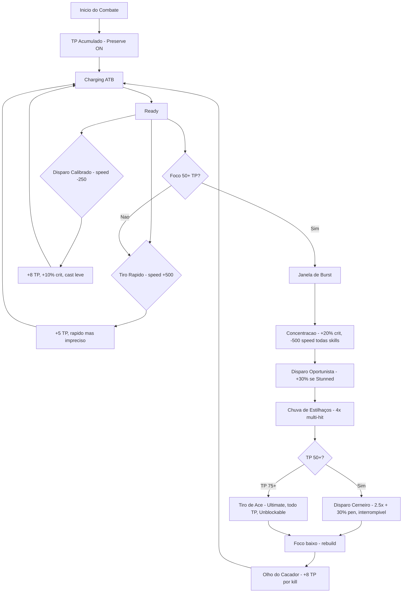

# Thorin - Fundeiro (Ranged/Precisao)

**Classe:** Fundeiro / Slinger
**Arma Principal:** Funda
**Papel:** DPS Fisico Ranged
**Papel Secundario:** Burst (janela curta de dano extremo)
**Referencias:** Caitlyn (LoL) — sniper setup-dependente, ultimate com cast longo e dano massivo, recompensa posicionamento e protecao do time
**Plugin Base:** VisuStella Battle Core, Enhanced TP System, ATB System, Skills & States Core, Auto Skill Trigger

---

## Visao Geral

Jovem anao protagonista, ex-quarteback do time "Machados Enferrujados". Usa funda com extrema precisao — a mesma usada no futebol runico. Thorin e o personagem mais fragil e mais recompensador de se jogar: precisa do time para brilhar, mas quando tudo se alinha, entrega o maior DPS do jogo. Setup-dependente, paciente, devastador.

---

## Estatisticas Base

| Atributo | Nivel | Descricao |
|----------|-------|-----------|
| **HP** | Baixo (-10%) | O mais fragil do time — sniper precisa de protecao |
| **MP** | Medio | Recursos para habilidades especiais |
| **ATK** | Alto (+10%) | Dano ranged consistente, maior DPS potencial |
| **DEF** | Baixo (-10%) | Vulneravel a melee, compensado pela backline |
| **AGI** | Medio | Velocidade padrao — nao e mobile como Filena |
| **MAT** | Nulo | Sem uso de magia |

## Atributos Base de Combate

| Atributo | Valor | Padrao | Nota |
|----------|-------|--------|------|
| **Taxa de Acerto (HIT)** | 105% | 100% | +5% (pilar de precisao do time) |
| **Taxa de Evasao (EVA)** | 5% | 5% | Padrao (sniper foca em protecao do time) |
| **Taxa de Critico (CRIT)** | 15% | 5% | +10% (tiros cirurgicos devastadores) |

**Sinergia:** HIT 105% compensa baixa precisao de Mhordred (90%) e Filena (90%) — e o pilar de precisao do time. CRIT 15% (+10% base) e a assinatura do sniper, alimentada pelo Foco (Crit +10 TP) e potencializada por Concentracao (+20%).

---

## Sistema de Recurso: Foco

Foco representa a disciplina mental de Thorin — a concentracao absoluta necessaria para tiros precisos. Diferente de Filena (momentum ativo) ou Mhordred (furia reativa), Foco se acumula lentamente, recompensando paciencia e planejamento. O payoff e direto: quanto mais focado, mais armadura seus projeteis ignoram.

### Foco (TP)

Thorin gera Foco lentamente — Critical Hits (+10 TP, maior bonus do jogo) e TP Regen (+2/turno) sao suas fontes principais. Preserve ON significa que o que ele acumula em uma batalha carrega para a proxima. A decisao central: acumular Foco para burst windows devastadoras, ou gastar incrementalmente em spenders leves?

**Mecanica unica — Foco converte em Armor Penetration:**

| Foco Atual | Armor Pen | Efeito Pratico |
|------------|-----------|----------------|
| 0-25 TP | 0% | Tiros normais — armadura absorve tudo |
| 26-50 TP | 5% | Perfurando leve |
| 51-75 TP | 15% | Tiros precisos atravessam protecao |
| 76-100 TP | 30% | Foco total = snipers ignoram armadura |

Isso significa que TODAS as skills de Thorin ficam mais fortes conforme ele acumula Foco — o incentivando a nao gastar precoce.

---

## Configuracao do TP Mode (VisuStella Enhanced TP System)

### General

| Parametro | Valor | Justificativa |
|-----------|-------|---------------|
| **TP Mode Name** | Foco | Disciplina mental do sniper |
| **Icon** | [a definir] | |
| **MaxTP Formula** | 100 (fixo) | Reservatorio para burst windows massivas |
| **TCR Multiplier** | 1.0 | Geracao lenta intencional — paciencia recompensada |
| **Preserve TP** | true | Acumula entre batalhas — identidade unica |

**Progressao de MaxTP por Level:**

| Level | MaxTP | Initial TP (%) | Notas |
|-------|-------|----------------|-------|
| 1 | 100 | Acumulado (Preserve) | Comeca com TP da batalha anterior |
| 5 | 100 | Acumulado | |
| 10 | 100 | Acumulado | |
| 15 | 100 | Acumulado | |
| 20 | 100 | Acumulado | |
| 25 | 100 | Acumulado | |
| 30 | 100 | Acumulado | |

### TP Formulas (Geracao)

| Trigger | Formula | TP Medio | Justificativa |
|---------|---------|----------|---------------|
| **Initial TP** | Acumulado (Preserve ON) | Variavel | Vem da batalha anterior |
| **Use Skill** | `5 + Math.floor(user.level / 10)` | 5-8 | Geracao ativa moderada |
| **Critical Hit** | `10` | 10 | **Assinatura** — maior bonus de crit do jogo |
| **TP Regen** | `2` | 2/turno | Acumulo natural passivo |

**Nota:** Enemy Death (+8 TP) e Win Battle (+15 TP) sao implementados como skill passiva (Olho do Cacador), nao como formula do TP Mode.

### Curva de Geracao (Ritmo Esperado)

**Ciclo tipico de Build (~5 acoes):**
- Acao 1: Tiro Rapido (+5 TP do Use Skill) — Total: 5 TP
- Acao 2: Disparo Calibrado (+8 TP) — Total: 13 TP
- Acao 3: Tiro Rapido (+5 TP, crit +10 TP = 15 TP) — Total: 28 TP
- Acao 4: Disparo Calibrado (+8 TP) — Total: 36 TP
- Acao 5: Tiro Rapido (+5 TP, TP Regen +2) — Total: 43 TP
- **Total por ciclo: ~43 TP**

**Para chegar a 75+ TP (Armor Pen 15%+):** ~5 acoes = 5 turnos de buildup ativo.

**Com Preserve ON:** Thorin entra no combate 2 com ~30-50 TP do combate 1, pulando 2-3 turnos de buildup.

---

## Integracao com o ATB

O Foco nao afeta diretamente o After Gauge. Em vez disso, Foco converte em **Armor Penetration** (mecanica unica de Thorin). A integracao ATB se da pelo trade-off de speed das skills:

- Skills rapidas (speed positivo): HIT penalizado pela constraint de velocidade/precisao
- Skills lentas (speed negativo / cast time): CRIT aumentado pela constraint

**Implementacao:** A conversao Foco → Armor Pen e implementada via State passiva (Olho de Falcao) que le `user.tp` e aplica `<JS Armor Penetration>` dinamico.

### Diagrama do Loop ATB-Foco



```
[Inicio do Combate - TP Acumulado]
    |
[Charging] → [Ready] → Tiro Rapido: +5 TP, speed +500 (rapido, impreciso)
    |                      |
[Charging] ← ← ← ← ← ← ←
    |
[Ready] → Disparo Calibrado: +8 TP, speed -250, +10% crit
    |
[Charging] → ... repetir até Foco 50+
    |
[Ready] → CONCENTRAÇÃO: +20% crit por 3 turnos, -500 speed em tudo
    |
[Ready] → Disparo Oportunista: 1.6x + 30% se Stunned (sinergia Kilin)
    |
[Ready] → Chuva de Estilhaços: 4x0.6 multi-hit
    |
[Ready] → Disparo Cerneiro: 2.5x + 30% pen (PRECISA de proteção Kilin)
    |
[Ready] → Tiro de Ace: TODO TP, ~3.5x, 50% pen, Unblockable
    |
[Foco ZERADO] → Rebuild via geradores + Olho do Caçador
```

---

## Kit de Skills

Todas as skills sao projetadas para terem um score final no **Tier 1 (1-50)**. A diferenca entre "Leve", "Medio" e "Pesado" nao esta no score, mas sim no **custo de Foco (TP)**, no **papel tatico** e nos **trade-offs** exigidos do jogador.

Spenders Leves focam em sinergia de time (marca, CC). Spenders Medios focam em burst e setup. Spenders Pesados focam em dano puro com alto risco. O Ultimate e o climax que consome todo o investimento.

**Constraint de velocidade/precisao:** Quanto mais rapida a skill (speed positivo), maior a chance de MISS. Quanto mais lenta (speed negativo), maior a chance de CRIT. Isso e implementado via HIT/CRIT modifiers por skill.

---

### Passivas

#### **1. Olho de Falcao**
- **Tipo:** Passiva
- **Descricao:** A disciplina de Thorin converte Foco acumulado em penetracao de armadura. Quanto mais focado, mais seus projeteis ignoram a defesa inimiga. Essa e a mecanica central que recompensa paciencia e buildup.
- **Efeito:** Armor Pen 0% → 5% → 15% → 30% baseado no nivel de Foco
  | Foco | Armor Pen |
  |------|-----------|
  | 0-25 | 0% |
  | 26-50 | 5% |
  | 51-75 | 15% |
  | 76-100 | 30% |
- **Implementacao VisuStella:** `<Passive State>` no Actor com `<JS Armor Penetration>` que le `user.tp` e aplica modificador correspondente via formula condicional.

#### **2. Olho do Cacador**
- **Tipo:** Passiva
- **Descricao:** Thorin capitaliza em cada eliminacao — cada inimigo abatido alimenta sua disciplina. Ao vencer o combate, Thorin absorve a experiencia e entra no proximo embate mais focado.
- **Efeito:**
  - Enemy Death: +8 TP (recupera Foco ao eliminar)
  - Win Battle: +15 TP (carrega bonus para proximo combate via Preserve ON)
- **Implementacao VisuStella:** `<Auto Trigger: Enemy Death>` com `<Gain TP: +8>` + `<Auto Trigger: Win Battle>` com `<Gain TP: +15>`

---

### Geradores

#### **3. Tiro Rapido**
- **Tipo:** Gerador (Dano)
- **Descricao:** Disparo rapido com a funda — impreciso mas util para manter o ritmo de Foco. A velocidade vem com o custo da precisao.
- **Papel tatico:** Gerar Foco + dano leve consistente
- **Implementacao VisuStella:** `<Gain TP: +5>`, speed +500, formula MOBA `1.0`. HIT penalizado pela constraint de velocidade/precisao.
- **Score Breakdown:**

| Modificador | Valor | Score | Eixo |
|-------------|-------|-------|------|
| Multiplicador | 1.0x | 0 | Efeito |
| Speed | +500 | +5 | Tempo |
| Ganho TP | +5 | +5 | Recurso |

- **Subtotal Efeito:** 0 x 2 = **0**
- **Subtotal Tempo:** **+5**
- **Subtotal Recurso:** **+5**
- **Score Final: 10 — Tier 1**

---

#### **4. Disparo Calibrado**
- **Tipo:** Gerador (Setup/Crit)
- **Descricao:** Thorin calibra a mira antes de disparar — mais lento mas mais preciso e recompensador. A paciencia gera mais Foco e chance de critico.
- **Papel tatico:** Gerar Foco + dano moderado com chance de crit (sinergia com Crit +10 TP do Foco)
- **Implementacao VisuStella:** `<Gain TP: +8>`, speed -250, formula MOBA `1.0`, `<Modify Critical Rate: +10%>`. Cast leve (gauge roxo).
- **Score Breakdown:**

| Modificador | Valor | Score | Eixo |
|-------------|-------|-------|------|
| Multiplicador | 1.0x | 0 | Efeito |
| Chance Critico | +10% | +8 | Efeito |
| Speed | -250 | -8 | Tempo |
| Ganho TP | +8 | +5 | Recurso |

- **Subtotal Efeito:** (0 + 8) x 2 = **16**
- **Subtotal Tempo:** **-8**
- **Subtotal Recurso:** **+5**
- **Score Final: 13 — Tier 1**

---

### Spenders Leves (Foco em Sinergia de Time)

#### **5. Tiro Perfurante**
- **Tipo:** Spender Leve (Dano + Sinergia Filena)
- **Descricao:** Um disparo focado que aproveita o Foco acumulado para perfurar armadura. Significativamente mais forte contra alvos marcados pela Filena.
- **Papel tatico:** DPS consistente que escala com Foco e sinergiza com marca da Filena
- **Implementacao VisuStella:** `<TP Cost: 12>`, speed 0, formula MOBA `1.3`, `<Armor Penetration: 15%>`. JS condicional para +25% dano se alvo tem State 140 (Marca).
- **Score Breakdown:**

| Modificador | Valor | Score | Eixo |
|-------------|-------|-------|------|
| Multiplicador | 1.3x | +10 | Efeito |
| Armor Pen | 15% | +8 | Efeito |
| Speed | 0 | 0 | Tempo |
| Custo TP | -12 | -8 | Recurso |

- **Subtotal Efeito:** (10 + 8) x 2 = **36**
- **Subtotal Tempo:** **0**
- **Subtotal Recurso:** **-8**
- **Score Final: 28 — Tier 1**

**Sinergia Filena:** +25% dano em alvos com State 140 (Marca). BONUS condicional, nao requisito.

---

#### **6. Disparo Desestabilizante**
- **Tipo:** Spender Leve (CC)
- **Descricao:** Projetil que atinge ponto vulneravel do inimigo, desestabilizando-o e reduzindo sua velocidade de acao.
- **Papel tatico:** Aplicar CC leve que habilita combos do time (sinergia com Disparo Oportunista que capitaliza em Stun)
- **Implementacao VisuStella:** `<TP Cost: 10>`, speed +250, formula MOBA `1.1`, `<Apply State: [AGI Down -25%]>`, `<State x Turns: +2>`.
- **Score Breakdown:**

| Modificador | Valor | Score | Eixo |
|-------------|-------|-------|------|
| Multiplicador | 1.1x | +8 | Efeito |
| Debuff ao Alvo | AGI -25% (2 turnos) | +8 | Efeito |
| Speed | +250 | +5 | Tempo |
| Custo TP | -10 | -8 | Recurso |

- **Subtotal Efeito:** (8 + 8) x 2 = **32**
- **Subtotal Tempo:** **+5**
- **Subtotal Recurso:** **-8**
- **Score Final: 29 — Tier 1**

---

### Spenders Medios (Foco em Burst e Setup)

#### **7. Chuva de Estilhaços**
- **Tipo:** Spender Medio (Multi-hit / Burst)
- **Descricao:** Thorin dispara uma rajada de projeteis fragmentados que atingem o alvo multiplas vezes. Inspirado em Ninefold Flurry (BD2). Cada hit beneficia do Armor Pen do Olho de Falcao.
- **Papel tatico:** Burst damage via multi-hits — cada hit pode critar, gerando TP extra via Crit +10 TP
- **Implementacao VisuStella:** `<TP Cost: 20>`, speed -500, `<Repeat Hits: 4>`, formula MOBA `0.6` por hit, `<Armor Penetration: 5%>`. Cast medio (gauge roxo).
- **Score Breakdown:**

| Modificador | Valor | Score | Eixo |
|-------------|-------|-------|------|
| Multiplicador | 0.6x (por hit) | -8 | Efeito |
| Multi-Hit | 4 hits | +22 | Efeito |
| Armor Pen | 5% | +8 | Efeito |
| Speed | -500 | -12 | Tempo |
| Custo TP | -20 | -15 | Recurso |

- **Subtotal Efeito:** (-8 + 22 + 8) x 2 = **44**
- **Subtotal Tempo:** **-12**
- **Subtotal Recurso:** **-15**
- **Score Final: 17 — Tier 1**

**Dano total:** 4 x 0.6 = 2.4x. Com Olho de Falcao a 76+ TP: 2.4x + 30% pen em cada hit. Com crit: cada hit pode gerar +10 TP de volta.

---

#### **8. Disparo Oportunista**
- **Tipo:** Spender Medio (Capitalizar Stun)
- **Descricao:** Thorin aproveita uma abertura no alvo para um disparo devastador. Significativamente mais forte contra alvos atordoados — a mecanica central de "capitalizar em CC".
- **Papel tatico:** Capitalizar em Stun do time (Kilin) — o payoff direto por coordenacao
- **Implementacao VisuStella:** `<TP Cost: 25>`, speed -750, formula MOBA `1.6`, `<Armor Penetration: 10%>`. JS condicional para +30% dano se alvo tem State Stun. Cast medio-longo.
- **Score Breakdown:**

| Modificador | Valor | Score | Eixo |
|-------------|-------|-------|------|
| Multiplicador | 1.6x | +15 | Efeito |
| Armor Pen | 10% | +8 | Efeito |
| Speed | -750 | -18 | Tempo |
| Custo TP | -25 | -18 | Recurso |

- **Subtotal Efeito:** (15 + 8) x 2 = **46**
- **Subtotal Tempo:** **-18**
- **Subtotal Recurso:** **-18**
- **Score Final: 10 — Tier 1**

**Sinergia Kilin:** +30% dano em alvos com State Stun. Dano efetivo com stun: 1.6 x 1.3 = 2.08x + 10% pen. BONUS condicional, nao requisito.

---

#### **9. Concentracao**
- **Tipo:** Spender Medio (Self-Buff / Setup)
- **Descricao:** Thorin entra em estado de concentracao absoluta — suas skills ficam mais lentas mas muito mais precisas e devastadoras. O trade-off central do kit: velocidade por poder.
- **Papel tatico:** Setup proprio — transforma a janela de burst em algo devastador
- **Efeito:** Por 3 turnos: +20% Critical Rate em todas as skills, mas speed -500 adicional em todas as skills
- **Implementacao VisuStella:** `<TP Cost: 18>`, speed 0 (instantaneo), aplica State "Concentracao" por 3 turnos. State tem `<Modify Critical Rate: +20%>` e efeito de speed -500 em todas as skills via JS hook.
- **Score Breakdown:**

| Modificador | Valor | Score | Eixo |
|-------------|-------|-------|------|
| Buff ao Usuario | +20% CRIT (3 turnos) | +8 | Efeito |
| Speed | 0 (instantaneo) | 0 | Tempo |
| Custo TP | -18 | -12 | Recurso |

- **Subtotal Efeito:** 8 x 2 = **16**
- **Subtotal Tempo:** **0**
- **Subtotal Recurso:** **-12**
- **Score Final: 4 — Tier 1**

**Trade-off:** Skills lentas sob Concentracao (-500 speed) = mais vulneravel. Mas +20% crit em TODAS as skills (incluindo multi-hits da Chuva de Estilhaços) = payoff massivo. Sinergia com Olho de Falcao: Concentracao + Foco alto = crit alto + armor pen alto.

---

### Spenders Pesados (Foco em Dano Puro com Risco)

#### **10. Disparo Desesperado**
- **Tipo:** Spender Pesado (Risco/Recompensa / AoE Aleatorio)
- **Descricao:** Em desespero, Thorin dispara 5 projeteis em inimigos aleatorios — caotico, arriscado, mas devastador se os projeteis convergirem no mesmo alvo.
- **Papel tatico:** Panic button / AoE desesperada — quando tudo da errado
- **Implementacao VisuStella:** `<TP Cost: 20>`, speed -250, `<Repeat Hits: 5>`, `<Target: 5 Random Enemies>`, formula MOBA `1.0` por hit.
- **Score Breakdown:**

| Modificador | Valor | Score | Eixo |
|-------------|-------|-------|------|
| Multiplicador | 1.0x (por hit) | 0 | Efeito |
| Multi-Hit | 5 hits | +22 | Efeito |
| Escopo | Aleatorio | -10 | Efeito |
| Speed | -250 | -8 | Tempo |
| Custo TP | -20 | -15 | Recurso |

- **Subtotal Efeito:** (0 + 22 - 10) x 2 = **24**
- **Subtotal Tempo:** **-8**
- **Subtotal Recurso:** **-15**
- **Score Final: 1 — Tier 1** (limítrofe)

**Dano total:** 5 x 1.0 = 5.0x distribuido aleatoriamente. Contra 1 inimigo: 5.0x concentrado. Contra 3: ~1.7x cada. Cada hit beneficia do Olho de Falcao.

---

#### **11. Disparo Cerneiro**
- **Tipo:** Spender Pesado (Single Target / Armor Pen)
- **Descricao:** O tiro mais poderoso do arsenal de Thorin — projetil pesado que ignora grande parte da armadura. Lento, telegrafado, interrompivel. PRECISA de protecao do Kilin (Bodyguard) para castar em seguranca.
- **Papel tatico:** Single target burst massivo — o payoff de acumular Foco
- **Implementacao VisuStella:** `<TP Cost: 45>`, speed -1250, formula MOBA `2.5`, `<Armor Penetration: 30%>`, `<ATB Interrupt>` (pode ser interrompido). Cast longo (gauge roxo).
- **Score Breakdown:**

| Modificador | Valor | Score | Eixo |
|-------------|-------|-------|------|
| Multiplicador | 2.5x | +34 | Efeito |
| Armor Pen | 30% | +15 | Efeito |
| Speed | -1250 | -28 | Tempo |
| Interruptivel | Sim | -8 | Tempo |
| Custo TP | -45 | -30 | Recurso |

- **Subtotal Efeito:** (34 + 15) x 2 = **98**
- **Subtotal Tempo:** **-36**
- **Subtotal Recurso:** **-30**
- **Score Final: 32 — Tier 1**

**Com Olho de Falcao a 76+ TP:** 30% (skill) + 30% (passiva) = 60% Armor Pen total. Quase ignora armadura completamente. Mas cast longo + interrompivel = alto risco.

---

### Ultimate

#### **12. Tiro de Ace**
- **Tipo:** Ultimate / Finisher
- **Inspiracao:** Ace in the Hole (Caitlyn, LoL) — mira longa, cast time devastador, dano massivo em single target
- **Descricao:** Thorin investe TODO o seu Foco em um unico tiro devastador. Mira, respira, e dispara o projetil mais poderoso que sua funda pode lancar. Requer protecao do time para completar o cast. Se interrompido, perde metade do Foco investido.
- **Papel tatico:** Finisher — climax do combate, elimina alvos prioritarios
- **Implementacao VisuStella:** `<TP Cost: user.tp>` (consome tudo), speed -2000, formula MOBA dinamica via JS: `2.0 + (tp_gasto / 100) * 2.0`, `<Armor Penetration: 50%>`, `<Unblockable>`, `<ATB Interrupt>` (pode ser interrompido). `<JS On Interrupt>` perde metade do TP gasto. After Gauge -25%.
- **Score Breakdown:**

| Modificador | Valor | Score | Eixo |
|-------------|-------|-------|------|
| Multiplicador | ~3.5x (media 75 TP) | +43 | Efeito |
| Armor Pen | 50% | +25 | Efeito |
| Unblockable | Sim | +15 | Efeito |
| Speed | -2000 | -35 | Tempo |
| After Gauge | -25% | -12 | Tempo |
| Interruptivel | Sim | -8 | Tempo |
| Custo TP | Todo TP (~75) | -40 | Recurso |
| Condicao Restritiva | Precisa de TP alto | -12 | Recurso |
| Consome Beneficio | Gasta todo Foco | -10 | Recurso |

- **Subtotal Efeito:** (43 + 25 + 15) x 2 = **166**
- **Subtotal Tempo:** **-55**
- **Subtotal Recurso:** **-62**
- **Score Final: 49 — Tier 1** (proximo do limite)

**Nota:** Dano escala com TP gasto. Com 50 TP: mult 3.0x. Com 75 TP: mult 3.5x. Com 100 TP: mult 4.0x. Apos uso, Thorin fica com 0 TP e After Gauge -25% — janela de vulnerabilidade massiva. Rebuild total necessario.

**Regra especial de interrupcao:** Se interrompido, perde metade do TP gasto (nao tudo — para nao ser frustrante demais). Implementado via `<JS On Interrupt: user.gainTp(-Math.floor(tpCost/2))>`.

---

### Tabela Consolidada do Kit

| # | Nome | Tipo | Papel | TP Cost | Dano | CC/Efeito | Speed | Score | Tier |
|---|------|------|-------|---------|------|-----------|-------|-------|------|
| 1 | Olho de Falcao | Passiva | Armor Pen Scaling | — | — | 0-30% Armor Pen | — | — | — |
| 2 | Olho do Cacador | Passiva | Recuperacao | — | — | +8 TP kill, +15 TP win | — | — | — |
| 3 | Tiro Rapido | Gerador | Dano/Loop | +5 | 1.0x | — | +500 | 10 | T1 |
| 4 | Disparo Calibrado | Gerador | Setup/Crit | +8 | 1.0x | +10% Crit | -250 | 13 | T1 |
| 5 | Tiro Perfurante | Sp. Leve | Dano + Filena | -12 | 1.3x | 15% Pen, +25% marcado | 0 | 28 | T1 |
| 6 | Disparo Desestabilizante | Sp. Leve | CC | -10 | 1.1x | AGI -25% 2t | +250 | 29 | T1 |
| 7 | Chuva de Estilhaços | Sp. Medio | Multi-hit/Burst | -20 | 4x0.6 | 5% Pen | -500 | 17 | T1 |
| 8 | Disparo Oportunista | Sp. Medio | Capitalizar Stun | -25 | 1.6x | 10% Pen, +30% stun | -750 | 10 | T1 |
| 9 | Concentracao | Sp. Medio | Self-Buff | -18 | — | +20% Crit 3t, -500 spd | 0 | 4 | T1 |
| 10 | Disparo Desesperado | Sp. Pesado | Risco/AoE | -20 | 5x1.0 | Random AoE | -250 | 1 | T1 |
| 11 | Disparo Cerneiro | Sp. Pesado | ST Burst | -45 | 2.5x | 30% Pen, interrompivel | -1250 | 32 | T1 |
| 12 | Tiro de Ace | Ultimate | Finisher | Todo | ~3.5x | 50% Pen, Unblockable | -2000 | 49 | T1 |

---

## Sinergias de Grupo

- **Filena (~15% dependencia):** Filena marca alvo (State 140) → Tiro Perfurante ganha +25% dano. Sinergia Setup + Payoff (Explicita). BONUS condicional — Thorin funciona sem marca, apenas com menos dano.

- **Kilin (~20% dependencia):** Principal enabler do Thorin. (1) Bodyguard permite castar Cerneiro e Tiro de Ace em seguranca. (2) Stun do Kilin → Disparo Oportunista +30% dano. Sinergia Protecao + Cast e Setup + Payoff (Explicita). Sem Kilin, Thorin pode castar mas corre risco de interrupcao e perde o bonus de stun — mais arriscado, nao inutilizavel.

- **Mhordred (~10% dependencia):** Mhordred tanka frontline e chama atencao → Thorin opera da backline sem pressao direta. Complementaridade natural de papeis (melee bruiser + ranged sniper). Sinergia Implicita.

- **Balastrus (~5% dependencia):** Debuffs alquimicos podem criar aberturas indiretas. Baixa interacao direta — Balastrus nao esta no time inicial. Sinergia Implicita.

**Teste de dependencia:** Remover qualquer personagem nao causa >50% de perda de eficacia em Thorin. Maxima dependencia: Kilin ~20% (protecao de cast + stun setup).

---

## Validacao

### 5-Layer Identity Check
- [x] **Fantasia central coerente:** "Atirador Disciplinado que converte precisao em poder" — todas as skills sao ranged, focadas em precisao, armor pen, crit
- [x] **Resource unique mantido:** Foco com Preserve ON, Crit +10 TP (maior bonus), Armor Pen 0-30% scaling
- [x] **Loop de gameplay identificavel:** Geradores → Buildup → Setup (Concentracao + team CC) → Burst → Recuperacao
- [x] **Skills assinatura presentes:** Olho de Falcao (Armor Pen scaling), Concentracao (self-buff), Tiro de Ace (ultimate Caitlyn)
- [x] **Diferenciais numericos preservados:** Preserve ON, Crit +10 TP, HIT 105%, CRIT 15%

### Kit Health Check
- [x] **Tem centro:** "Setup-dependent DPS que recompensa maestria"
- [x] **Tem loop:** Abertura → Buildup → Setup → Payoff → Recuperacao
- [x] **Tem assinatura:** Foco→Armor Pen + Concentracao + Tiro de Ace
- [x] **Tem fraqueza:** Muito fragil, cast interrompivel, geracao lenta, depende de protecao
- [x] **Tem espaco de mastery:** Facil: geradores + spenders leves. Dificil: timing de Concentracao, coordenar stuns, maximizar ultimate

### Constraints Rigidas (referencias.md)
- [x] **Mais fragil e mais recompensador:** HP baixo (-10%), DEF baixa (-10%), maior DPS potencial
- [x] **Maior DPS com maestria:** Concentracao + Foco alto + Cerneiro/Tiro de Ace = dano massivo
- [x] **Setup-dependente:** Foco→Armor Pen, Concentracao, Stun→Oportunista, Bodyguard→Cast
- [x] **Equilibrio velocidade/precisao:** Rapido = miss risk, Lento = crit chance (por skill)
- [x] **Cast interrompivel:** Cerneiro e Tiro de Ace podem ser interrompidos
- [x] **Recompensar via multi-hits:** Chuva de Estilhaços (4x), Disparo Desesperado (5x random)
- [x] **Capitalizar em CC:** Disparo Oportunista +30% em alvo Stunned

### Anti-Pattern Scan
- [x] **Nenhuma skill "sempre correta":** Cada skill tem trade-off claro
- [x] **Nenhuma skill redundante:** Todas funcoes distintas
- [x] **Nenhum kit sem centro:** Fantasia clara
- [x] **Nenhum balanceamento homogeneo:** Diversidade de speed (+500 a -2000), TP (+5 a todo), armor pen (0-50%)
