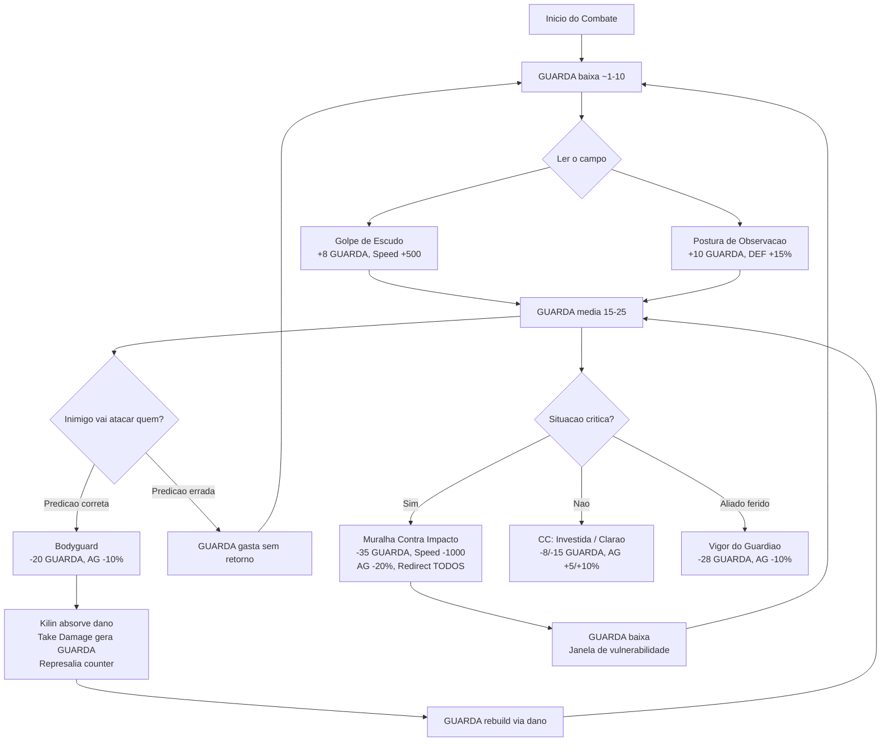

# Kilin - Paladin (Espada + Escudo)

**Classe:** Paladin / Guardiao
**Arma Principal:** Espada + Escudo
**Papel:** Tank / Protetor
**Papel Secundario:** Suporte (buffs defensivos) + Controlador (CC leve com escudo)
**Referencias:** Bravely Default II — Shieldmaster/Bastion, Defender of the People
**Plugin Base:** VisuStella Battle Core, Skills & States Core, Enhanced TP System, ATB System

---

## Visao Geral

Comandante da Guarda de Ferro, mentor do Thorin e melhor amigo do Mhordred. Anao veterano de decadas de combate, calmo, tatico e silencioso. Kilin le o campo de batalha como ninguem — antecipa ataques, protege no momento certo e transforma leitura tatica em vantagem para o time inteiro.

---

## Estatisticas Base

| Atributo | Nivel | nv30 | Descricao |
|----------|-------|------|-----------|
| **HP** | Alto (+10%) | — | Durabilidade extra para tank |
| **MP** | Medio | — | Recursos para curas light |
| **ATK** | Medio | 120 | Dano consistente mas nao primario |
| **DEF** | Alto (+10%) | — | Melhor defesa do time |
| **AGI** | Baixo | — | Posicao firme, nao mobilidade |
| **MAT** | Medio | — | Curas light com escala DEF |

## Atributos Base de Combate

| Atributo | Valor | Padrao | Nota |
|----------|-------|--------|------|
| **Taxa de Acerto (HIT)** | 100% | 100% | Padrao (suficiente para suporte) |
| **Taxa de Evasao (EVA)** | 0% | 5% | -5% (nao esquiva, absorve) |
| **Taxa de Critico (CRIT)** | 0% | 5% | -5% (nao foca em dano) |
| **Defesa (DEF)** | +10% | 0% | Tank puro |
| **PV Maximo (HP)** | +10% | 0% | Durabilidade extra |

**Sinergia:** EVA 0% e CRIT 0% reforçam a identidade de tank puro — Kilin nao esquiva, nao busca critico. Absorve dano e converte em GUARDA. DEF +10% e HP +10% maximizam a eficiencia do loop de protecao.

---

## Sistema de Dano MOBA (VisuStella Battle Core)

O projeto usa o **Damage Style MOBA** do VisuStella Battle Core. O campo `formula` das skills recebe um **multiplicador float** direto. O plugin calcula automaticamente: `Dano = formula × ATK × (100 / (100 + DEF_alvo))`.

**Regra crítica:** O campo `formula` é um multiplicador float, NÃO uma porcentagem inteira. Para detalhes completos, consulte `planos/021-balnceamento-status/filena/POSTMORTEM-FORMULAS-MOBA.md`.

| Tier | Dano Esperado (vs DEF 120) | Multiplicador MOBA |
|------|---------------------------|-------------------|
| Counter (Represalia) | ~64 | `1.17` |
| Gerador | ~99 | `1.82` |
| Leve/Médio (CC) | ~146 | `2.68` |

*Referência: ATK Kilin nv30 = 120 vs DEF 120 (Cristaleão).*

---

## Sistema de Recurso: GUARDA

GUARDA representa a tensao defensiva acumulada por Kilin durante o combate. Cada golpe absorvido, cada leitura correta do campo de batalha aumenta sua determinacao. O jogador precisa decidir constantemente: acumular GUARDA (ficar mais resistente via Resistencia do Ferro) ou gastar em protecao ativa (Bodyguard, Muralha). Gastar GUARDA deixa Kilin mais vulneravel — a tensao entre acumular e gastar e o cerne da decisao tatica.

### GUARDA (TP)

GUARDA e gerada passivamente ao absorver dano (Take HP Damage) e ativamente via Golpe de Escudo e Postura de Observacao. O loop central e: ler o inimigo → prever alvo → gerar GUARDA → usar Bodyguard no aliado certo → o dano interceptado gera GUARDA extra → sustenta o ciclo. Se o jogador erra a predicao, gasta GUARDA sem retorno e precisa rebuild.

---

## Configuracao do TP Mode (VisuStella Enhanced TP System)

### General

| Parametro | Valor | Justificativa |
|-----------|-------|---------------|
| **TP Mode Name** | GUARDA | Identidade do recurso — tensao defensiva acumulada |
| **Icon** | [icone de escudo] | Representa protecao |
| **MaxTP Formula** | `Math.min(50, 5 + Math.floor(user.level * 1.5))` | Cap 50 no level 30 — barra menor, decisoes mais apertadas |
| **TCR Multiplier** | `1.0` | Tank padrao — sem aceleracao especial |
| **Preserve TP** | `false` | TP zera entre combates — rebuild constante por encontro |

**Progressao de MaxTP por Level:**

| Level | MaxTP | Initial TP (20%) | Notas |
|-------|-------|-------------------|-------|
| 1 | 6 | ~1 | Limitado — precisa tomar hits |
| 5 | 12 | ~2 | Primeiros spenders leves |
| 10 | 20 | ~4 | Bodyguard acessivel |
| 15 | 27 | ~5 | Spenders medios liberados |
| 20 | 35 | ~7 | Spenders pesados viaveis |
| 25 | 42 | ~8 | Quase no cap |
| 30 | 50 | ~10 | **Cap atingido.** Full power. |

### TP Formulas (Geracao)

| Trigger | Formula | TP Medio | Justificativa |
|---------|---------|----------|---------------|
| **Initial TP** | `Math.floor(user.maxTp() * 0.20)` | 1-10 | Comeca com margem minima |
| **Take HP Damage** | `Math.floor(damage / 20)` | Variavel | Base passiva — cada hit absorvido |
| **TP Regen** | `+3` | 3/turno | Sustento minimo por turno |
| **Evasion** | `0` | 0 | EVA 0% — nunca esquiva |
| **Critical Hit** | `0` | 0 | CRIT 0% — nunca critica |
| **Enemy Death** | `0` | 0 | Nao e reward por kill |
| **Win Battle** | `0` | 0 | Preserve OFF |

### Curva de Geracao (Ritmo Esperado)

**Ciclo tipico de Build (~3 acoes):**
- Acao 1: Golpe de Escudo (+8 GUARDA, dano 1.0x) — Total: 8 GUARDA
- Acao 2: Postura de Observacao (+10 GUARDA, DEF +15%) — Total: 18 GUARDA
- Acao 3: Golpe de Escudo (+8 GUARDA, dano 1.0x) + TP Regen +3 — Total: ~29 GUARDA

**Para chegar a 35+ GUARDA (Spender Pesado):** ~3 acoes + Take Damage passivo = ~3-4 turnos de build ativo.

---

## Integracao com o ATB

Kilin nao possui `<JS ATB After Gauge>` dinamico como Filena. Cada skill define seu proprio After Gauge estaticamente:

| Tipo de Skill | After Gauge | Efeito |
|---------------|-------------|--------|
| Protecao (Bodyguard, Vigor) | -10% | Lento apos proteger — janela de risco |
| CC (Investida, Clarao, Desarmando) | +5% a +10% | Rapido apos CC — permite transicao |
| Buff/Suporte (Muralha Pessoal) | +5% | Ritmo estavel |
| Geradores (Golpe, Postura) | 0% | Sem modificacao — rebuild padrao |
| Ultimate (Muralha Impacto) | -20% | Muito lento — custo massivo |

### Diagrama do Loop ATB-GUARDA

---

## Kit de Skills

Todas as skills sao projetadas para terem um score final no **Tier 1 (1-50)**. A diferenca entre "Leve", "Medio" e "Pesado" esta no **custo de GUARDA**, no **papel tatico** e nos **trade-offs** exigidos do jogador. Cada skill de dano lista sua **Formula MOBA** (multiplicador float para o campo `formula` do VisuStella).

Leves focam em CC (Stun, Blind). Medios focam em protecao direta e utilidade (barreira, redirect, interrupt). Pesados focam em sustento (cura). A Ultimate e o botao de emergencia que consome quase toda a GUARDA.

### Passivas

#### **1. Resistencia do Ferro**
- **Tipo:** Passiva
- **Descricao:** DEF de Kilin escala com GUARDA acumulada. Quanto mais GUARDA, mais resistente. Quando gasta GUARDA em Bodyguard, a DEF cai — ele fica mais vulneravel apos proteger. Tensao entre acumular (ficar mais tank) vs gastar (proteger aliado).
- **Efeito:** Cada 10 GUARDA = +5% DEF (max +25% com 50 GUARDA).
- **Implementacao VisuStella:** State permanente com `<JS Passive Condition>` que aplica buff de DEF baseado no TP atual via `<JS Param Rate>`. Formula: `Math.floor(user.tp / 10) * 0.05` aplicado como multiplicador de DEF.

#### **2. Represalia**
- **Tipo:** Passiva
- **Descricao:** Quando Kilin intercepta dano via Bodyguard (predicao correta), ele automaticamente contra-ataca o agressor com golpe de escudo. Dano escala com DEF. So ativa quando intercepta dano PARA UM ALIADO — nao ativa quando Kilin e atacado diretamente. Bodyguard no aliado "errado" = sem counter.
- **Efeito:** Counter com formula MOBA `1.17`. Dano = 1.17 × ATK × mit = ~64 mitigado (vs DEF 120).
- **Nota de design:** Originalmente projetado como DEF-scaling (`user.def * 0.5`). O POSTMORTEM padronizou para ATK-scaling via MOBA (1.17 × 120 × 0.4545 ≈ 64 vs DEF × 0.5 = 70). Valores similares, implementacao consistente com o sistema.
- **Implementacao VisuStella:** `<Counter Control>` triggerado por interceptacao de dano via Bodyguard state. Campo `formula`: `1.17`. Trigger condicional: so ativa quando o estado de Bodyguard redireciona dano (verifica se target original != Kilin). Skill ID 64.

---

### Geradores

#### **3. Golpe de Escudo**
- **Tipo:** Gerador (Dano)
- **Descricao:** Impacto rapido com o escudo — golpe basico do Kilin. Mantem o loop quando nao tem GUARDA para spenders. Rapido (Speed +500) para重建 resource.
- **Score Breakdown:**

| Modificador | Valor | Score | Eixo |
|-------------|-------|-------|------|
| Multiplicador Dano | 1.0x | 0 | Efeito |
| Speed | +500 | +8 | Tempo |
| Ganho TP | +8 | +5 | Recurso |

- **Subtotal Efeito:** 0 x 2 = **0**
- **Subtotal Tempo:** **+8**
- **Subtotal Recurso:** **+5**
- **Score Final: 13** — **Tier 1**

- **Implementacao VisuStella:** `<Gain TP: +8>`, Speed +500 no parametro do skill.

**Formula MOBA:** `1.82` — Dano = 1.82 × ATK × mit = ~99 mitigado (vs DEF 120). Skill ID 65.

---

#### **4. Postura de Observacao**
- **Tipo:** Gerador (Setup)
- **Descricao:** Kilin assume postura defensiva e observa o campo. Gera mais GUARDA enquanto aumenta DEF. Referencia ao "Bulwark" de Bravely Default. Escolha: dano (Golpe de Escudo) ou defesa (Postura).
- **Score Breakdown:**

| Modificador | Valor | Score | Eixo |
|-------------|-------|-------|------|
| Multiplicador Dano | 0.5x | -8 | Efeito |
| Buff Usuario (DEF 1 stack) | +15% 3 turnos | +8 | Efeito |
| Speed | 0 | 0 | Tempo |
| Ganho TP | +10 | +8 | Recurso |

- **Subtotal Efeito:** 0 x 2 = **0**
- **Subtotal Tempo:** **0**
- **Subtotal Recurso:** **+8**
- **Score Final: 8** — **Tier 1**

- **Implementacao VisuStella:** `<Gain TP: +10>`, `<DEF Buff Turns: +3>`, `<Apply State: [postura state]>`. State com DEF Rate +15%.

**Formula MOBA:** `1.82` — Dano = 1.82 × ATK × mit = ~99 mitigado (vs DEF 120). Skill ID 66.

---

### Spenders Leves (Foco em CC)

#### **5. Investida de Escudo**
- **Tipo:** Spender Leve (CC — Stun)
- **Descricao:** Kilin avanca com o escudo para desestabilizar o inimigo. Hard CC rapido — After Gauge +10% permite transicao direta para Bodyguard. Loop: Stun → Bodyguard.
- **Score Breakdown:**

| Modificador | Valor | Score | Eixo |
|-------------|-------|-------|------|
| Multiplicador Dano | 1.0x | 0 | Efeito |
| CC: Stun | 100%, 1 turno | +25 | Efeito |
| After Gauge | +10% | +7 | Tempo |
| Custo TP | -15 | -10 | Recurso |

- **Subtotal Efeito:** 25 x 2 = **+50**
- **Subtotal Tempo:** **+7**
- **Subtotal Recurso:** **-10**
- **Score Final: 47** — **Tier 1**

- **Implementacao VisuStella:** `<TP Cost: 15>`, `<Apply State: [Stun]>`, `<State x Turns: 1>`, `<ATB After Gauge: +10%>`.

**Formula MOBA:** `2.68` — Dano = 2.68 × ATK × mit = ~146 mitigado (vs DEF 120). Skill ID 67.

---

#### **6. Clarao do Escudo**
- **Tipo:** Spender Leve (CC — Blind)
- **Descricao:** Kilin inclina o escudo para refletir luz e cegar o inimigo. Referencia ao "Blinding Flash" de Bravely Default. Mais barato que Investida (8 vs 15), dura mais (3 vs 1 turno), mas efeito mais fraco (reduz HIT vs remove turno).
- **Score Breakdown:**

| Modificador | Valor | Score | Eixo |
|-------------|-------|-------|------|
| Multiplicador Dano | 0.8x | -5 | Efeito |
| CC: Cegueira | 100%, 3 turnos | +10 | Efeito |
| After Gauge | +5% | +5 | Tempo |
| Custo TP | -8 | -6 | Recurso |

- **Subtotal Efeito:** 5 x 2 = **+10**
- **Subtotal Tempo:** **+5**
- **Subtotal Recurso:** **-6**
- **Score Final: 9** — **Tier 1**

- **Implementacao VisuStella:** `<TP Cost: 8>`, `<Apply State: [Cegueira]>`, `<State x Turns: 3>`, `<ATB After Gauge: +5%>`.

**Formula MOBA:** `2.68` — Dano = 2.68 × ATK × mit = ~146 mitigado (vs DEF 120). Skill ID 68.

---

### Spenders Medios

#### **7. Golpe Desarmando**
- **Tipo:** Spender Medio (Interrupcao)
- **Descricao:** Kilin avanca e desfere golpe de escudo no inimigo que esta conjurando. Segundo eixo de leitura tatica — nao so "quem sera atacado" mas "quando o inimigo vai conjurar". Bodyguard = reativo, Golpe Desarmando = proativo. Acerta timing → custo efetivo menor. Erra → gastou GUARDA em ataque fraco.
- **Score Breakdown:**

| Modificador | Valor | Score | Eixo |
|-------------|-------|-------|------|
| Multiplicador Dano | 0.8x | -5 | Efeito |
| Interrupt | sim | +10 | Efeito |
| After Gauge | +5% | +5 | Tempo |
| Custo TP | -15 | -10 | Recurso |

- **Subtotal Efeito:** 5 x 2 = **+10**
- **Subtotal Tempo:** **+5**
- **Subtotal Recurso:** **-10**
- **Score Final: 5** — **Tier 1**

- **Implementacao VisuStella:** `<TP Cost: 15>`, `<ATB Interrupt>`, `<Gain TP: +5>` condicional via `<JS On Use Action>` verificando cast state do alvo, `<ATB After Gauge: +5%>`.

**Nota:** Bonus condicional de +5 GUARDA quando interrompe com sucesso. Custo efetivo: -10 GUARDA na predicao correta.

**Formula MOBA:** `2.68` — Dano = 2.68 × ATK × mit = ~146 mitigado (vs DEF 120). Skill ID 69.

---

#### **8. Muralha Pessoal**
- **Tipo:** Spender Medio (Barreira Individual)
- **Descricao:** Kilin ergue barreira em torno de 1 aliado, absorvendo proximo ataque com reducao de 50%. Referencia ao "Rampart/Vallation" de Bravely Default. Protege 1 aliado de 1 hit sem commitar Bodyguard completo. Bom para Thorin (fragil).
- **Score Breakdown:**

| Modificador | Valor | Score | Eixo |
|-------------|-------|-------|------|
| Buff Aliado Individual | barreira 1 hit | +15 | Efeito |
| After Gauge | +5% | +5 | Tempo |
| Custo TP | -14 | -11 | Recurso |

- **Subtotal Efeito:** 15 x 2 = **+30**
- **Subtotal Tempo:** **+5**
- **Subtotal Recurso:** **-11**
- **Score Final: 24** — **Tier 1**

- **Implementacao VisuStella:** `<TP Cost: 14>`, `<Apply State: [Barreira]>`, State com `<Remove by Damage>`, `<Damage Rate: 50%>`, `<State Turns: 2>`, `<ATB After Gauge: +5%>`.

---

#### **9. Bodyguard**
- **Tipo:** Spender Medio (Protecao Direta) — Assinatura
- **Descricao:** A skill assinatura do Kilin. Interceptar todo dano direcionado ao aliado escolhido. Leitura tatica central — prever quem sera atacado. Predicao correta: Kilin absorve dano → Take Damage gera GUARDA → Represalia ativa counter → loop sustentado. Predicao errada: GUARDA gasta sem retorno, Kilin lento e vulneravel.
- **Score Breakdown:**

| Modificador | Valor | Score | Eixo |
|-------------|-------|-------|------|
| Buff Aliado Individual | redirect | +15 | Efeito |
| After Gauge | -10% | -7 | Tempo |
| Custo TP | -20 | -14 | Recurso |

- **Subtotal Efeito:** 15 x 2 = **+30**
- **Subtotal Tempo:** **-7**
- **Subtotal Recurso:** **-14**
- **Score Final: 9** — **Tier 1**

- **Implementacao VisuStella:** `<TP Cost: 20>`, `<Apply State: [Bodyguard State]>` no aliado, State com damage redirect via action sequence/JS, `<Damage Rate: 75%>`, `<ATB After Gauge: -10%>`. Duracao: ate proximo turno de Kilin.

---

### Spenders Pesados (Foco em Sustento)

#### **10. Vigor do Guardiao**
- **Tipo:** Spender Pesado (Cura)
- **Descricao:** Kilin canaliza energia defensiva para curar um aliado. O mentor que restaura seus protegidos. Paladino que sacrifica GUARDA para recuperar HP. Custo altissimo (56% da barra). Escolha: prevenir dano futuro (Bodyguard -20) ou curar dano passado (-28). Nao da para fazer os dois no mesmo ciclo.
- **Score Breakdown:**

| Modificador | Valor | Score | Eixo |
|-------------|-------|-------|------|
| Cura Direta | Moderada (25-40%) | +20 | Efeito |
| After Gauge | -10% | -7 | Tempo |
| Custo TP | -28 | -20 | Recurso |

- **Subtotal Efeito:** 20 x 2 = **+40**
- **Subtotal Tempo:** **-7**
- **Subtotal Recurso:** **-20**
- **Score Final: 13** — **Tier 1**

- **Implementacao VisuStella:** `<TP Cost: 28>`, `<Target: 1 Ally>`, formula de cura via `<JS Damage Formula>` usando `150 + user.def * 2.0`, `<ATB After Gauge: -10%>`.
- **Nota MOBA:** Esta formula de cura NAO passa pelo sistema MOBA (MOBA aplica apenas a dano). Como Certain Hit (hitType 0), a formula e avaliada diretamente: `150 + DEF × 2.0` = `150 + 280` = ~430 de cura com DEF ~140. Validar se Hit Type esta como Certain Hit (0) para evitar scaling indesejado.

---

### Ultimate

#### **11. Muralha Contra Impacto**
- **Tipo:** Finisher / Ultimate
- **Descricao:** Kilin planta os pes, ergue o escudo e se torna muralha viva. Por 1 turno, intercepta TODO dano direcionado a QUALQUER aliado. O momento onde o Protetor Tatico vira O Muro. Inspirado em "Defender of the People" de Bravely Default. Botao de emergencia — quase toda a GUARDA gasta + speed lento + After Gauge -20%. Se conectar, time intocavel por 1 turno.
- **Score Breakdown:**

| Modificador | Valor | Score | Eixo |
|-------------|-------|-------|------|
| Buff Aliados Time | redirect todos | +25 | Efeito |
| Buff Usuario DEF | +30% | +8 | Efeito |
| Speed | -1000 | -20 | Tempo |
| After Gauge | -20% | -10 | Tempo |
| Custo TP | -35 | -25 | Recurso |

- **Subtotal Efeito:** 33 x 2 = **+66**
- **Subtotal Tempo:** **-30**
- **Subtotal Recurso:** **-25**
- **Score Final: 11** — **Tier 1**

- **Implementacao VisuStella:** `<TP Cost: 35>`, Speed -1000, `<ATB After Gauge: -20%>`, `<Apply State: [Muralha]>` em si mesmo. State com damage redirect para todos os aliados via `<Aura State>` ou action sequence, `<Damage Rate: 50%>`, `<DEF Buff Turns: +1>`. Telegrafado (Speed -1000 = cast time visivel).

**Nota:** Ultimate de emergencia. Custo de 70% da GUARDA + Speed lento + After Gauge pesado. Recompensa: 1 turno de invulnerabilidade do time.

---

### Tabela Consolidada do Kit

| # | Nome | Tipo | Papel | TP Cost | MOBA | Dano Mitigado | CC/Efeito | Speed | AG | Score | Tier |
|---|------|------|-------|---------|------|---------------|-----------|-------|-----|-------|------|
| 1 | Resistencia do Ferro | Passiva | DEF scaling | — | — | — | DEF +5%/10 GUARDA | — | — | — | — |
| 2 | Represalia | Passiva | Counter | — | `1.17` | ~64 | Counter em intercept | — | — | — | — |
| 3 | Golpe de Escudo | Gerador | Dano | 0 | `1.82` | ~99 | +8 GUARDA | +500 | 0% | 13 | T1 |
| 4 | Postura de Observacao | Gerador | Setup | 0 | `1.82` | ~99 | DEF +15% 3t, +10 GUARDA | 0 | 0% | 8 | T1 |
| 5 | Investida de Escudo | Leve | CC Stun | -15 | `2.68` | ~146 | Stun 1t 100% | 0 | +10% | 47 | T1 |
| 6 | Clarao do Escudo | Leve | CC Blind | -8 | `2.68` | ~146 | Blind 3t 100% | 0 | +5% | 9 | T1 |
| 7 | Golpe Desarmando | Medio | Interrupt | -15 | `2.68` | ~146 | Interrupt condicional | 0 | +5% | 5 | T1 |
| 8 | Muralha Pessoal | Medio | Barreira | -14 | — | — | Barreira 1 aliado | 0 | +5% | 24 | T1 |
| 9 | Bodyguard | Medio | Redirect | -20 | — | — | Redirect 1 aliado, -25% | 0 | -10% | 9 | T1 |
| 10 | Vigor do Guardiao | Pesado | Cura | -28 | Cura | ~430 | Cura (150+DEFx2.0) | 0 | -10% | 13 | T1 |
| 11 | Muralha Contra Impacto | Ultimate | Redirect All | -35 | — | — | Redirect TODOS, -50%, DEF+30% | -1000 | -20% | 11 | T1 |

**Dano mitigado calculado com ATK 120 vs DEF 120 (Cristaleao). Cura do Vigor com DEF ~140.**

---

### Comparacao entre Skills de Protecao

| Skill | Custo | Escopo | Duracao | Tipo | Quando usar |
|-------|-------|--------|---------|------|-------------|
| Muralha Pessoal | -14 | 1 aliado | 1 hit ou 2 turnos | Barreira | Proteger fragil de 1 hit sem commit |
| Bodyguard | -20 | 1 aliado (predicao) | Ate prox. turno | Redirect | Predicao de alvo — payoff alto |
| Muralha Contra Impacto | -35 | TODOS | 1 turno | Redirect total | Emergencia — time em perigo |

---

## Sinergias de Grupo

- **Filena (Momentum):** Kilin protege Filena quando ela usa Ira da Duelista (DEF -50%). Bodyguard salva a duelista em seu momento mais vulneravel. Filena gera Momentum alto → atrai aggro → Kilin intercepta → Kilin gera GUARDA → sustenta protecao. Sinergia tipo Protecao + Risco. **Dependencia: ~25%** — Filena ainda tem evasao e mobilidade sem Kilin.

- **Mhordred (Furia):** Duo tank+bruiser. Mhordred em Furia Berserker (ATK +50%, DEF -25%) fica vulneravel → Kilin tanka enquanto ele casta livremente. Sinergia tipo Protecao + Cast. **Dependencia: ~20%** — Mhordred tem HP alto e auto-sustain sem Kilin.

- **Thorin (Foco):** Kilin protege o ranged fragil (HP baixo). Muralha Pessoal e especificamente boa para Thorin — protege de 1 hit sem commit total. Thorin marca alvo (Marcacao) → time foca dano → Kilin garante que Thorin continue vivo. Sinergia tipo Protecao + Execucao. **Dependencia: ~20%** — Thorin pode se reposicionar sem Kilin.

- **Balastrus:** Estimulante de Combate (ATK+AGI +15%) em Kilin → Kilin age mais rapido para Bodyguard. Constructo de Defesa complementa protecao de Kilin (camada dupla). Acido Corrosivo (DEF -20% no inimigo) → Kilin foca protecao sem preocupar com dano. Sinergia tipo Suporte + Defesa. **Dependencia: ~20%** — Balastrus tem constructs sem Kilin.

---

## Validacao

### 5-Layer Identity Check
- [x] **Fantasia central coerente:** "O Protetor Tatico" — todas skills giram em torno de protecao, leitura de campo e escudo
- [x] **Resource unique mantido:** GUARDA — gerado por absorcao, MaxTP 50, Preserve OFF
- [x] **Loop de gameplay identificavel:** Geradores → Spenders (CC/Buff/Protecao) → Rebuild → Repetir
- [x] **Skills assinatura presentes:** Bodyguard (predicao) + Muralha Contra Impacto (ultimate)
- [x] **Diferenciais numericos preservados:** MaxTP 50, EVA 0%, CRIT 0%, DEF +10%, HP +10%

### Kit Health Check
- [x] **Tem centro:** Protecao por predicao de alvo
- [x] **Tem loop:** Build GUARDA → Gasta em protecao/CC → Rebuild. Janela de vulnerabilidade pos-Bodyguard
- [x] **Tem assinatura:** GUARDA + Bodyguard + Represalia = ecossistema unico
- [x] **Tem fraqueza:** MaxTP 50 limita opcoes, EVA 0%, Preserve OFF, sem burst de dano
- [x] **Tem espaco de mastery:** Predicao facil de entender, dificil de dominar

### Anti-Pattern Scan
- [x] **Nenhuma skill "sempre correta":** Cada skill tem trade-off claro (custo GUARDA, After Gauge, condicional)
- [x] **Nenhuma skill redundante:** Muralha Pessoal (1 hit) vs Bodyguard (redirect total) vs Muralha Impacto (todos)
- [x] **Kit com centro claro:** Protecao por predicao
- [x] **Sem balanceamento homogeneo:** CC, Barreira, Redirect, Cura, Interrupt — cada uma resolve problema diferente

### Regras de Balanceamento
- [x] **Todas skills em Tier 1 (1-50):** Scores de 5 a 47
- [x] **Min. negativos por tier:** Todas passam (T1 = min 0)
- [x] **Max 8 positivos:** Max 4 por skill
- [x] **Anti-distorcoes:** Nenhuma violada
- [x] **Sinergias saudaveis:** Todas abaixo de 25% de dependencia (teste: remover Kilin nao causa >50% de perda em nenhum personagem)

[[02_Atlas_Folk/02.2_Personagens/Killin|Perfil narrativo de Kilin]]
