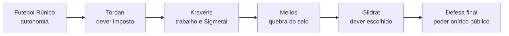

# Thorin Forja-Prata - Documentação Narrativa

> [!abstract] Essência do personagem
> Thorin é o protagonista jogável da história de Gildrat. Ele começa como jovem anão nobre, jogador de Futebol Rúnico, tentando provar que é mais do que o filho de Tordan. A campanha transforma essa rebeldia inicial em liderança escolhida: Thorin aprende a proteger a cidade sem abandonar sua identidade original.

> [!warning] Escopo da consolidação
> Este documento consolida informações já existentes. Ele não cria acontecimentos novos. Quando as Quests entram em conflito com GDD ou notas mais recentes, a leitura prioriza intenção narrativa, papel do personagem e arco geral.

## Como Usar Este Documento

Este arquivo foi organizado para funcionar bem no Obsidian sem virar apenas uma planilha. As tabelas aparecem quando ajudam a comparar ou consultar rápido; os trechos interpretativos ficam em texto corrido, para orientar roteiro, design, arte e implementação.

Referências rápidas:

- [[#1. Resumo]] - visão curta do personagem.
- [[#2. Descrição Geral]] - identidade, aparência, personalidade, motivações e conflitos.
- [[#4. Participação ao Longo da Campanha]] - evolução por grandes momentos.
- [[#5. Arco do Personagem]] - estado inicial, catalisador, desenvolvimento, clímax e estado final.
- [[#8. Coerência Narrativa]] - inconsistências encontradas.
- [[#9. Pontos que Precisam de Definição]] - decisões pendentes.

## Ficha Rápida

| Campo | Informação consolidada |
| --- | --- |
| Nome | Thorin Forja-Prata |
| Raça | Anão |
| Origem | Família Forja-Prata, ligada às Grandes Casas de Gildrat |
| Pai | Tordan Forja-Prata |
| Mãe | Mélia, ausente/desaparecida ou dada como morta conforme a fonte |
| Identidade inicial | Jogador dos Machados Enferrujados |
| Função inicial | Fundeiro/atirador de Futebol Rúnico |
| Função de combate | Fundeiro/Slinger, DPS físico à distância, preciso e dependente de preparo |
| Papel narrativo | Protagonista jogável do passado narrado por Rheed |
| Tema central | Identidade diante do destino histórico |

## 1. Resumo

Thorin Forja-Prata é o protagonista jogável da história narrada por Rheed no passado de Gildrat. Ele começa como um jovem anão de origem nobre, jogador talentoso de Futebol Rúnico dos Machados Enferrujados, em conflito com o pai, Tordan, e com o futuro militar/minerador que a sociedade espera dele.

Ao ser forçado a participar de expedições mineradoras e depois manipulado por Balastrus no caminho para Melios, Thorin entra em contato direto com o Sigmetal, com os conflitos de classe de Gildrat e com a ameaça dos Ignotos.

Seu arco principal é a passagem da rebeldia reativa para uma liderança escolhida, marcada pelo despertar de um dom espiritual/onírico herdado de sua mãe, Mélia. Narrativamente, Thorin representa a pergunta central do jogo: diante de um destino histórico maior que ele, quem ele escolhe se tornar?

## 2. Descrição Geral

### Identidade

Thorin pertence à família Forja-Prata, uma casa nobre ligada ao poder militar e político de Gildrat. Isso o coloca em uma posição contraditória desde o início: ele tem privilégios reais, mas sua identidade afetiva e social está ligada ao Futebol Rúnico, aos Machados Enferrujados e a pessoas que vivem muito mais próximas das castas trabalhadoras.

Ele é filho de Tordan, general e figura de autoridade rígida. A relação com o pai é um dos motores emocionais centrais do Ato I. Thorin não quer ser apenas herdeiro, soldado ou peça de um projeto familiar. Ele quer ser reconhecido pelo que faz em campo e pelo valor que constrói por conta própria.

> [!note] Fato documentado vs. interpretação
> É fato documentado que Thorin é jovem anão, filho de Tordan, jogador dos Machados Enferrujados e usuário de funda. A leitura de que ele funciona como ponte entre elite e trabalhadores é uma interpretação consolidada a partir de GDD, Futebol Rúnico, Filena, Borin e quests de preparação.

### Aparência

A documentação ainda não descreve a aparência física de Thorin em detalhes. Não foram encontrados dados oficiais sobre cabelo, olhos, barba, altura exata, marcas corporais ou silhueta específica.

O que existe é uma identidade visual funcional:

- Thorin é um jovem anão.
- Está associado ao uniforme/equipamento do Futebol Rúnico.
- Usa funda, capacete e objetos esportivos.
- Passa a usar armadura quando é forçado a entrar em contexto de escolta, mineração e combate.
- Seu quarto na Casa Forja-Prata mistura sinais de nobreza, rebeldia, projetos pessoais e Futebol Rúnico.

> [!missing] Definição visual pendente
> A arte ainda precisa definir visual oficial: corpo, barba, cabelo, olhos, uniforme, armadura por ato, funda e elementos herdados de Tordan/Mélia.

### Idade Aproximada

Não há idade numérica documentada. Os textos o tratam como "jovem anão" e como alguém da mesma faixa social e dramática de Filena e Borin. Como a expectativa média dos anões é documentada em torno de 80 anos, qualquer número específico seria especulativo.

Uso recomendado até definição oficial: chamar Thorin apenas de **jovem anão**.

### Profissão ou Função

No início, Thorin é jogador de Futebol Rúnico dos Machados Enferrujados, atuando como fundeiro/atirador. Esse detalhe não é apenas decorativo: ele explica sua arma, sua precisão, sua postura em combate e parte de sua linguagem emocional.

Ao longo da campanha, suas funções mudam:

- jogador de Futebol Rúnico;
- filho nobre em conflito com a casa militar;
- aprendiz forçado de mineração/exploração;
- sobrevivente e testemunha da crise de Melios;
- possível membro ou figura legitimada da Guarda de Ferro;
- articulador de defesa de Gildrat;
- portador de um dom espiritual/onírico perigoso para a ordem política de Gildrat.

### Personalidade

Thorin começa talentoso, rebelde, competitivo e indisciplinado. Ele tem impulsos claros de fuga, principalmente quando percebe que Tordan tenta controlar seu futuro. Também demonstra insegurança quando seu privilégio é confrontado por Filena e Borin.

Esse início não deve ser lido como falta de potencial heroico. O ponto é que Thorin ainda não sabe transformar talento em responsabilidade. Ele quer reconhecimento, mas ainda mistura autonomia com reação emocional. A campanha força essa transformação.

Traços documentados ou sustentados pelas Quests:

- talento real com a funda;
- rebeldia contra autoridade;
- atraso/indisciplina no começo;
- competitividade;
- impulso de provar valor;
- ciúme e proteção em relação a Filena;
- insegurança diante de Tordan;
- crescimento gradual em direção à liderança.

### Motivações

No começo, a motivação de Thorin é pessoal: ser reconhecido por mérito próprio e não pelo sobrenome Forja-Prata. O Futebol Rúnico é o caminho que ele escolhe para isso.

Com a campanha, essa motivação se amplia. Thorin passa a querer proteger Filena, sobreviver às expedições, entender os sonhos ligados à mãe e responder à ameaça dos Ignotos. No Ato III, sua motivação deixa de ser "provar que posso escolher minha vida" e passa a ser "assumir responsabilidade sem deixar que outros definam quem sou".

### Valores

Os valores mais fortes associados a Thorin são:

- autonomia;
- reconhecimento por mérito;
- lealdade aos vínculos pessoais;
- coragem prática;
- memória familiar;
- proteção da comunidade;
- cooperação entre grupos sociais em crise.

### Medos

Os medos de Thorin aparecem de forma direta e indireta. Ele teme perder autonomia, fracassar diante do pai e ser reduzido a peça política ou militar. Depois de Melios, o medo se amplia: perder aliados, ver Gildrat ruir e ser perseguido pelo próprio dom.

O medo mais importante para o clímax é perder a própria identidade para forças espirituais, especialmente por causa do Profeta e da Casca Onírica.

### Conflitos Internos

O conflito interno central é entre **liberdade pessoal** e **dever imposto**. Thorin quer uma vida que reconheça seu talento e desejo; Tordan e Gildrat tentam empurrá-lo para uma função militar, familiar e política.

Outros conflitos internos importantes:

- privilégio nobre vs. identificação com trabalhadores, atletas e excluídos;
- desejo de reconhecimento do pai vs. raiva da autoridade paterna;
- ciúme/proteção vs. confiança e maturidade;
- medo da magia vs. necessidade de usar o próprio dom;
- preservar quem é vs. tornar-se aquilo que a crise exige.

### Conflitos Externos

Thorin enfrenta conflitos externos em várias escalas.

No plano íntimo, Tordan é a autoridade que tenta moldá-lo. No plano social, Filena e Borin o obrigam a encarar o privilégio. No plano político, Balastrus, Damburr e o Conselho mostram como pessoas podem ser manipuladas por ambição, status e necessidade. No plano espiritual e bélico, Ignotos e Profeta ameaçam Gildrat e a identidade do próprio Thorin.

### Relações e Grupos

Thorin pertence à família Forja-Prata e, por nascimento, às estruturas das Grandes Casas. Porém, sua identidade inicial está no Futebol Rúnico e nos Machados Enferrujados. Conforme a campanha avança, ele se aproxima da Guarda de Ferro, da força civil, dos rebeldes, dos Corvos e dos artesãos ligados ao Sigmetal.

Isso faz de Thorin um personagem de interseção: ele pode conversar com grupos que normalmente não se reconhecem como parte do mesmo destino.

## 3. Papel na História

Thorin é o protagonista jogável da campanha no passado. Sua função narrativa principal é oferecer ao jogador o ponto de vista íntimo da queda de equilíbrio de Gildrat: uma crise que começa como conflito familiar e social, passa por exploração política e mineradora, e se revela como ameaça espiritual e histórica.

Ele existe na narrativa para cumprir quatro funções centrais:

- **Protagonista de identidade:** o jogador define como Thorin amadurece, quais vínculos preserva e que tipo de líder ele se torna.
- **Ponte social:** Thorin pertence à elite por nascimento, mas se conecta aos trabalhadores, atletas, rebeldes e grupos marginalizados por meio do Futebol Rúnico, de Filena e das quests de preparação.
- **Ponte espiritual:** seu dom herdado de Mélia conecta Gildrat a tradições reprimidas, ao Reino da Mana, aos sonhos e à memória dos mortos.
- **Catalisador de alianças:** na reta final, Thorin pode articular Guarda, civis, Corvos, técnicos, ferreiros e antigos rivais contra os Ignotos.

Ele não é apenas soldado, mago ou herdeiro nobre. A função dramática de Thorin é ficar no cruzamento entre essas identidades e decidir, sob pressão, quais delas ainda podem coexistir.

> [!important] Direção de escrita
> Thorin deve amadurecer sem apagar sua origem esportiva. O Futebol Rúnico é parte do vocabulário emocional, social e mecânico do personagem.

## 4. Participação ao Longo da Campanha

### Visão Geral por Grandes Momentos

| Momento | Função de Thorin | Mudança principal |
| --- | --- | --- |
| Noite da História | Personagem histórico narrado por Rheed | O jogador entra na memória do passado |
| Futebol e família | Jogador rebelde em conflito com Tordan | Autonomia contra dever imposto |
| Kravens e minas | Aprendiz forçado e sobrevivente | Confronto com trabalho, classe e Sigmetal |
| Caminho para Melios | Jovem manipulado por Balastrus | Afeto e insegurança são usados politicamente |
| Quebra do selo | Testemunha da crise real | A ameaça deixa de ser pessoal e vira histórica |
| Retorno a Gildrat | Herdeiro que reivindica dever por escolha | A rebeldia vira liderança pública |
| Defesa final | Protetor exposto pela própria magia | Identidade e vínculos são testados |

### Moldura Narrativa - Noite da História

Na moldura com Rheed, Thorin é apresentado como personagem histórico/narrado. O jogador parte da Noite da História no presente e é conduzido para o passado, assumindo Thorin em Gildrat.

Essa estrutura reforça que a campanha lida com memória, tradição oral e inevitabilidade histórica. O destino macro pode ser conhecido ou limitado, mas a experiência do jogador está em descobrir quem Thorin foi, como reagiu e quais vínculos moldaram sua trajetória.

**Quests/fontes de sustentação:** `Noite da História`, documentos gerais de narrativa e fundação.

### Ato I - Futebol, Família e Primeira Ruptura

Thorin entra na história como um jovem anão que deseja reconhecimento pelo Futebol Rúnico. A semifinal dos Machados Enferrujados estabelece seu talento, sua relação com Filena, sua impontualidade e sua recusa em aceitar o destino militar/minerador planejado por Tordan.

O conflito com o pai transforma uma vitória esportiva em punição. Tordan desvaloriza o futebol e força Thorin a trabalhar com Balastrus em uma expedição. A partir daí, o arco deixa de ser apenas "jovem rebelde contra pai severo" e passa a envolver classe, trabalho, autoridade e sobrevivência.

Nessa fase, Thorin tenta preservar sua autonomia, reage mal à imposição paterna e mostra insegurança diante de Borin e Filena. Ao mesmo tempo, começa a ser confrontado por seu privilégio e descobre que o mundo fora do campo de futebol é mais perigoso e politicamente carregado do que imaginava.

**Quests/fontes de sustentação:** `Semifinal`, `Fim de Jogo`, `É Hora de Crescer`, `Primeiro Contrato`.

### Ato I/II - Minas, Sigmetal e Sobrevivência

Durante a expedição a Kravens, Thorin é obrigado a aprender mineração e lidar com a autoridade brutal de Balastrus. A documentação reforça sua necessidade de provar que não é apenas um nobre protegido.

O encontro com Cristaleão e Sigmetal introduz um recurso material que depois pode ser decisivo na defesa de Gildrat. Mais importante que o item em si, porém, é o tipo de dilema que ele abre: posse, confiança, uso militar e responsabilidade coletiva.

A travessia perigosa, a avalanche e a Mina do Esgoto deslocam Thorin da rebeldia para a sobrevivência. Ele passa a depender mais claramente de Kilin, Mhordred e Filena. A autoridade dos guardas deixa de ser apenas prisão e começa a virar aprendizado prático.

**Quests/fontes de sustentação:** `Minerador Aprendiz`, `Travessia Perigosa`, `Travessia Tóxica`, `Ameaça Lupina`, `Barganha Sigmetal`.

### Ato II - Manipulação Política e Caminho para Melios

A versão revisada de `A Voz do Conselho` muda o motor dramático desta fase. Thorin não vai a Melios simplesmente por convocação direta ou acusação contra Filena; ele é conduzido por uma manipulação política de Balastrus usando Futebol Rúnico, financiadores e o vínculo de Thorin com Filena.

Aqui, Thorin acredita estar escolhendo agir por Filena, mas a documentação deixa claro que essa escolha foi induzida. Isso aprofunda seu conflito central: ele quer ser livre, mas ainda pode ser conduzido por insegurança, ciúme, senso de proteção e falta de visão política.

> [!warning] Prioridade de versão
> A versão revisada de `A Voz do Conselho` deve prevalecer sobre versões antigas que usam acusação contra Filena ou convocação mais direta.

**Quests/fontes de sustentação:** `A Voz do Conselho` revisada, notas políticas de Gildrat, documentos de Balastrus e Filena.

### Ato II - Quebra do Selo e Perda da Inocência

Melios é o ponto de ruptura da campanha. Embora a Quest 12 esteja incompleta e ainda precise de alinhamento com a timeline, a intenção narrativa consolidada é clara: a ambição de Balastrus e da elite mineradora rompe um limite ancestral, libera ou desperta a ameaça dos Ignotos e expõe Thorin ao Profeta das Sombras.

O impacto narrativo para Thorin é profundo. A crise deixa de ser sobre provar valor para o pai ou proteger Filena em uma missão ruim. Agora há uma ameaça que ultrapassa sua família, sua classe, seu time e sua cidade.

O sacrifício ou cativeiro de Kilin, conforme a versão, também transforma a relação de Thorin com a Guarda de Ferro. Quem antes podia parecer carcereiro passa a ser alguém que precisa ser honrado, resgatado ou reconhecido.

**Quests/fontes de sustentação:** `Quebra do Selo em Melios`, timeline v5, Core Concept, documentos de magia e Ignotos.

### Ato III - Retorno a Gildrat e Escolha do Dever

Após Melios, Thorin retorna a uma Gildrat politicamente fraturada e sob ameaça. A documentação aponta um momento importante em que ele reivindica seu lugar na Guarda de Ferro usando o próprio sobrenome: não para obedecer passivamente a Tordan, mas para obter legitimidade e agir.

Essa virada é essencial para o arco. Thorin não aceita o dever porque foi quebrado pelo pai. Ele reapropria o dever como escolha. Seu amadurecimento não apaga a rebeldia, mas a transforma em liderança pública.

Na preparação de Gildrat, Thorin pode:

- reconstruir ou agravar a relação com Tordan;
- coordenar resgates e alianças;
- converter habilidades do Futebol Rúnico em tática civil;
- ajudar a treinar guardas, civis, rebeldes e possivelmente Corvos;
- decidir como usar Sigmetal, tecnologia e recursos humanos;
- ser reconhecido por pessoas fora da elite.

**Quests/fontes de sustentação:** `Quando Segundo Sol Chegar`, `Troféu Quebrado`, quests de `v_armadilhas`, `V_força_civil`, `V_força_guarda`, `V_influência_corvos`, `V_sigmetal`.

### Ato III - Defesa de Gildrat

A defesa de Gildrat é o grande teste público de Thorin. As variáveis de preparação indicam que o jogador pode influenciar armadilhas, moral, força civil, força da Guarda, relação com Corvos e uso de Sigmetal.

O clímax documentado envolve Thorin usando seu poder onírico/espiritual publicamente e enfrentando a influência do Profeta por meio da Casca Onírica ou possessão parcial. A party precisa purificá-lo ou salvá-lo sem destruí-lo, o que traduz mecanicamente o tema de identidade ameaçada.

Nesse ponto, Thorin lidera sob pressão real, expõe um poder que Gildrat teme, arrisca a própria identidade para proteger a cidade e depende dos vínculos construídos pelo jogador. A ameaça imediata pode ser contida, mas a guerra não termina.

**Quests/fontes de sustentação:** `Fase Final`, `Última Missão do Jogo`, timeline v5, documentos de magia e Profeta/Ignotos.

### Epílogo e Gancho

O final consolidado aponta uma vitória temporária. Gildrat pode ser defendida naquele momento, mas a ameaça maior continua. O retorno do Futebol Rúnico no pós-créditos funciona como sinal de memória, respiro e continuidade emocional, não como restauração completa da normalidade.

O gancho do Profeta e do exército maior reforça que Thorin não encerrou sua jornada. Ele atravessou o primeiro colapso e sobreviveu transformado.

## 5. Arco do Personagem

### Estrutura do Arco

| Etapa | Estado de Thorin | Função dramática |
| --- | --- | --- |
| Estado inicial | Jovem nobre, jogador, rebelde, resistente à autoridade do pai | Definir identidade e desejo de autonomia |
| Catalisador inicial | Punição de Tordan e trabalho com Balastrus | Tirar Thorin do espaço onde ele tinha controle |
| Desenvolvimento | Minas, travessia, Sigmetal, Filena, Kilin e Mhordred | Confrontar privilégio, medo e dependência do grupo |
| Catalisador maior | Melios, quebra do selo, Ignotos, Profeta e Kilin em risco | Transformar crise pessoal em responsabilidade histórica |
| Clímax | Defesa de Gildrat e uso público do poder onírico | Testar identidade, vínculos e liderança |
| Estado final | Protetor emergente, marcado pela guerra e pelo dom | Encerrar com vitória parcial e guerra aberta |

### Estado Inicial

Thorin começa como um jovem anão nobre que deseja ser reconhecido pelo Futebol Rúnico, não pelo sobrenome Forja-Prata. Ele é talentoso, rebelde, emocionalmente reativo e resistente à autoridade do pai. Seu mundo gira em torno de Filena, do time, da necessidade de provar valor e da recusa de se tornar extensão da carreira militar de Tordan.

Também há, desde o início, sinais oníricos ligados à mãe. Thorin sonha com Mélia e recebe alertas, mas ainda não compreende plenamente a natureza desse vínculo nem suas implicações políticas e espirituais.

### Catalisador

O catalisador inicial é a punição de Tordan após a semifinal: Thorin é arrancado do Futebol Rúnico e colocado sob Balastrus em uma missão de mineração. Esse evento força o personagem para fora do espaço onde ele se sente competente e o lança em conflitos de trabalho, classe, autoridade e perigo real.

O catalisador maior do arco é Melios. A manipulação de Balastrus, a quebra do selo, o surgimento dos Ignotos, o contato com o Profeta e a perda/cativeiro de Kilin transformam Thorin de jovem em crise pessoal em liderança necessária de uma cidade ameaçada.

### Desenvolvimento

O desenvolvimento de Thorin acontece em camadas:

- **Familiar:** ele deixa de reagir apenas ao pai e começa a formular sua própria relação com dever, legado e responsabilidade.
- **Social:** ele percebe que seu privilégio é real, mas também pode ser usado para abrir caminhos, negociar com facções e proteger quem não tem voz.
- **Afetiva:** sua relação com Filena amadurece quando ele deixa de agir apenas por ciúme/proteção e passa a reconhecer a autonomia dela.
- **Marcial:** o jogador de funda se torna combatente, tático e articulador de defesa.
- **Espiritual:** os sonhos e o dom herdado de Mélia deixam de ser sinais íntimos e passam a ser risco público.
- **Política:** Thorin entende que Balastrus, Tordan, Damburr, Conselho, Corvos e trabalhadores fazem parte de um sistema em tensão, não de conflitos isolados.

### Clímax

O maior momento dramático documentado é a defesa de Gildrat, quando Thorin usa o poder onírico/espiritual publicamente contra a ameaça dos Ignotos e depois sofre a influência do Profeta por meio da Casca Onírica ou de uma possessão parcial.

Esse clímax concentra seus conflitos centrais:

- ele precisa liderar a cidade que talvez o tema;
- precisa usar um poder herdado de uma linhagem perseguida;
- precisa confiar nos aliados que cultivou;
- precisa ser salvo sem ser reduzido a ameaça;
- precisa provar que sua identidade não será tomada pelo Profeta.

### Estado Final

Ao final do primeiro jogo/campanha documentada, Thorin se torna um protetor emergente de Gildrat. Ele não é mais apenas atleta, filho rebelde ou peça nobre. Ele é uma liderança em formação, marcada pela guerra, pela exposição do próprio dom e pela consciência de que o conflito real está apenas começando.

O estado final exato ainda depende de decisões narrativas pendentes, especialmente sobre sua posição formal na Guarda, a reação pública ao uso de magia, o destino de Kilin e Mhordred, o grau de reconciliação com Tordan, a relação final com Filena e a possível partida para buscar ajuda externa em uma continuação.

### O Que Ele Aprende

Thorin aprende que autonomia não é ausência de responsabilidade. Ele também aprende que legado familiar pode ser confrontado, herdado ou transformado, mas não simplesmente ignorado. O arco o obriga a reconhecer que seus aliados têm agência própria e que a tradição espiritual reprimida de Gildrat talvez seja necessária para enfrentar aquilo que a política oficial causou.

### O Que Ele Perde

Thorin perde a inocência do Futebol Rúnico como espaço separado da política. Perde também a segurança de uma identidade simples, a privacidade sobre seus sonhos e seu poder, e parte da confiança na ordem de Gildrat. Dependendo da versão final e das escolhas, pode perder aliados ou vínculos de forma permanente.

### O Que Ele Conquista

Thorin conquista respeito por ação, não apenas por nome. Ele também conquista legitimidade para liderar, capacidade de unir grupos diferentes, maior compreensão do legado de Mélia e um lugar dramático próprio, separado da sombra de Tordan.

### Mudança de Visão de Mundo

Thorin começa perguntando: "como provo meu valor?". Ao final, a pergunta muda para: "que tipo de responsabilidade eu aceito, sem deixar de ser eu mesmo?".

## 6. Relações

### Visão Geral

| Personagem/Grupo | Relação inicial | Evolução | Situação final |
| --- | --- | --- | --- |
| Tordan | Pai autoritário e antagonista doméstico | Possível reconhecimento mútuo | Variável/pendente |
| Mélia | Mãe ausente, morta ou desaparecida conforme fonte | Presença onírica e origem do dom | Estado real indefinido |
| Filena | Amiga, parceira de futebol e possível interesse afetivo | Tensão de classe, proteção e parceria civil | Variável por empatia |
| Borin | Rival esportivo/social | Pode virar responsabilidade moral | Inconsistente |
| Kilin | Escolta/vigilância | Mentor prático e alvo de resgate | Pendente |
| Mhordred | Guarda duro e relutante | Irmão de armas | Inconsistente |
| Balastrus | Patrão abusivo e manipulador | Culpado por Melios, aliado ambíguo depois | Pendente |
| Corvinus/Corvos | Hostilidade em Melios | Possível pacto e aliança | Variável |
| Profeta/Ignotos | Ameaça pressentida/desconhecida | Antagonismo existencial | Não resolvido |

### Tordan

A relação com Tordan é o eixo familiar do arco. No início, Tordan representa dever imposto, disciplina militar e negação do Futebol Rúnico como futuro legítimo. Para Thorin, isso transforma o pai em obstáculo direto à própria identidade.

Com o avanço da campanha, a relação ganha mais camadas. A documentação de Tordan sugere que ele não é apenas cruel: ele é um homem preso a dever, medo, luto e incapacidade emocional. A quest `Troféu Quebrado` abre espaço para uma conversa em que o conflito pode deixar de ser só obediência e virar reconhecimento doloroso.

Situação final: variável ou pendente. Há possibilidades de reconciliação, perdão parcial, respeito prático e presença de Tordan no pós-créditos, mas falta definir como ele reage ao uso público de magia por Thorin.

### Mélia

Mélia é a mãe ausente de Thorin e a origem provável de seu dom espiritual/onírico. A relação é mediada por sonhos, memória e ausência. Ela não funciona apenas como lembrança familiar: sua linhagem conecta Thorin a tradições reprimidas por Gildrat.

O estado real de Mélia ainda não está fechado. Algumas fontes a tratam como morta, outras como desaparecida, e a entrevista sugere revelação futura de que ela vive. Para este jogo, o papel consolidado é: presença onírica, alerta espiritual e herança proibida.

### Filena

Filena é amiga de infância, parceira de Futebol Rúnico, possível interesse afetivo e contraponto social. Ela força Thorin a encarar que seu sofrimento com Tordan não apaga seu privilégio diante das castas trabalhadoras.

No Ato II, o vínculo com Filena é usado por Balastrus para conduzir Thorin a Melios. Isso é importante porque mostra uma fragilidade do personagem: ele quer agir por conta própria, mas ainda pode ser manipulado por afeto, ciúme e proteção.

No Ato III, Filena sustenta a ponte com força civil, rebeldes e treinamento comunitário. A relação amadurece quando Thorin deixa de tentar apenas protegê-la e passa a reconhecê-la como agente política.

Situação final: variável ou pendente, com indícios de flags de empatia/relacionamento.

### Borin

Borin começa como rival esportivo e social. Ele provoca Thorin pelo privilégio, pela posição no time e pela relação com Filena. Essa rivalidade ajuda a tirar Thorin de uma leitura confortável de si mesmo.

Nas quests finais, Borin pode virar responsabilidade moral e aliado ocasional, especialmente se for resgatado com rebeldes. A documentação, porém, tem uma contradição forte: uma entrevista isolada menciona Borin como fantasma sem saber, enquanto a maioria das Quests o trata como rival vivo/resgatável.

> [!warning] Atenção de produção
> Não usar a ideia de Borin fantasma sem validação narrativa. Ela muda profundamente a função dele e conflita com a maior parte do material atual.

### Kilin

Kilin começa como escolta e vigilância, mas evolui para mentor prático. Ele ensina Thorin por presença, cautela, tática e sobrevivência. O sacrifício ou cativeiro em Melios muda a forma como Thorin entende a Guarda de Ferro.

Quando Thorin age para resgatar Kilin ou honrar seu papel, ele deixa de ver a Guarda apenas como braço de Tordan e passa a enxergar nela uma responsabilidade assumida.

Situação final: parcialmente indefinida. Há resgate, trauma e fragmentação em versões diferentes.

### Mhordred

Mhordred começa como guarda duro, agressivo e relutante em atuar como "babá" de Thorin. O respeito nasce quando Thorin demonstra coragem e responsabilidade em situações reais.

Depois de Melios, Mhordred tende a reconhecer Thorin como irmão de armas e possível liderança. Ainda assim, o destino final dele é inconsistente entre fontes: algumas sugerem morte/sacrifício e futuro fantasma; a timeline v5 indica que mortes de Tordan e Mhordred foram removidas desse momento.

### Balastrus

Balastrus é patrão abusivo, inventor ambicioso e manipulador. Ele usa Thorin como mão de obra, peça política e instrumento para seus objetivos. Sua função é fazer Thorin encontrar a face técnica e política da ambição de Gildrat.

Após Melios, Balastrus pode ajudar na defesa com tecnologia, dinamites, armadilhas e Sigmetal. Isso não apaga sua culpa. A relação final deve equilibrar utilidade estratégica e responsabilização.

### Corvinus e os Corvos

Os Corvos começam como força hostil ou isolada em Melios, mas podem se tornar aliados por meio de resgate, pacto e reconhecimento de tradição. Para Thorin, essa relação reforça o tema de que Gildrat precisa de saberes que tentou marginalizar.

### Damburr e o Conselho

Damburr e o Conselho representam o poder político distante que molda Tordan, reprime magia e viabiliza exploração. A documentação sugere ligação entre Damburr, caça às bruxas, desaparecimento de Mélia e perigo político do dom de Thorin.

Falta definir como essa estrutura reage ao uso público de magia por Thorin.

### Profeta das Sombras e Ignotos

Os Ignotos e o Profeta transformam o arco de Thorin em ameaça existencial. O perigo não é apenas morrer, mas perder autonomia e identidade. Por isso a Casca Onírica/possessão parcial funciona tão bem como clímax: a batalha final coloca o "quem sou eu?" de Thorin em termos literais.

### Rheed

Rheed não tem relação direta documentada com Thorin no passado jogável. Sua função é metanarrativa: ele organiza a memória do jogador sobre Thorin e conecta a história ao futuro de Daratrine.

### Sãparo

Sãparo aparece como companheiro doméstico e apoio tonal, especialmente nas cenas de casa e despertar. Há possível ligação simbólica com sonhos ou Canção Ancestral, mas isso ainda não está consolidado.

## 7. Temas Representados

### Autonomia e Destino Imposto

Thorin começa tentando escapar do futuro definido por Tordan e pela elite. Seu crescimento está em transformar dever imposto em responsabilidade escolhida. Esse é o coração do personagem.

### Identidade Sob Pressão

O jogo não pergunta apenas se Thorin sobrevive. A pergunta principal é quem ele se torna quando futebol, família, magia, guerra e política entram em choque.

### Classe e Pertencimento

Thorin nasce na elite, mas se identifica com atletas, trabalhadores e civis. Ele evidencia tanto o privilégio das Grandes Casas quanto a possibilidade de usá-lo para proteger grupos sem acesso a poder.

### Família, Luto e Legado

A relação com Tordan e Mélia estrutura o conflito emocional do personagem. Tordan representa disciplina, medo e legado militar. Mélia representa memória, sonho e herança proibida.

### Tradição Reprimida

O dom de Thorin e as Velhas Canções apontam para conhecimentos que Gildrat tentou negar. A ameaça dos Ignotos sugere que apagar tradições não elimina suas consequências.

### Tecnologia, Mineração e Ambição

Por meio de Balastrus, Sigmetal e Melios, Thorin testemunha como progresso técnico sem limite espiritual/político pode romper equilíbrios antigos.

### Liderança Comunitária

A preparação de Gildrat mostra Thorin unindo guardas, civis, rebeldes, Corvos e artesãos. Sua liderança não é apenas comando militar; é coordenação de confiança.

### Esperança Melancólica

A vitória final é parcial. Thorin pode salvar pessoas e preservar memória, mas não impedir todo o curso da história. Isso se alinha ao tema central de Daratrine: a agência está em quem se é diante do inevitável.

## 8. Coerência Narrativa

### Inconsistências Encontradas

> [!warning] Núcleo da revisão
> O problema principal não é falta de material sobre Thorin. O núcleo dele é forte. A fragilidade está no excesso de versões simultâneas sobre Melios, magia, destinos finais e alguns personagens de apoio.

**Ausência anterior de ficha narrativa própria:** Thorin tinha ficha de combate e várias menções espalhadas, mas não uma ficha narrativa consolidada equivalente às de Tordan, Filena, Borin, Kilin, Mhordred e Balastrus.

**Grafia de nomes:** aparecem variações como Tordan/Thordan, Balastrus/Balastros, Damburr/Dambur, Filena/Filene, Kilin/Kileen, Mhordred/Mordrit e Melios/Mélios. Este documento usa as formas mais recorrentes no GDD atual.

**Tusk em documentos antigos:** algumas timelines e fluxos citam Tusk, mas uma entrevista registra que "Tusk não existe mais". Isso sugere resíduo de versões anteriores.

**Causalidade de `A Voz do Conselho`:** versões antigas falam em acusação contra Filena ou convocação mais direta. A versão revisada substitui isso por manipulação via Futebol Rúnico, financiadores e uso emocional de Filena para levar Thorin a Melios.

**Quest 12 incompleta/desalinhada:** `Quebra do Selo em Melios` documenta coerção, trabalho forçado e dinamites, mas não cobre com a mesma clareza todos os eventos da timeline v5/Core Concept, como liberação dos Ignotos, visão do Profeta e destino de Kilin.

**Despertar mágico:** alguns documentos indicam sonhos desde o início, outros dizem que Thorin só acessa magia após voltar de Melios, e outros enfatizam o uso público no clímax. A leitura mais coerente é separar presságios/sonhos passivos iniciais de uso ativo e público do poder no Ato III, mas isso precisa ser confirmado.

**Natureza do dom:** o poder é descrito como comunicação com mortos, dom onírico, magia herdada de Mélia, acesso ao Reino da Mana e interação com espíritos. Todas as descrições são compatíveis em tema, mas falta taxonomia final.

**Destino de Mélia:** há fontes em que ela é dada como morta, desaparecida ou viva em segredo, com revelação posterior em Arcaror.

**Destino de Mhordred:** algumas fontes sugerem morte/sacrifício e retorno como fantasma em jogo futuro; a timeline v5 indica que mortes de Tordan e Mhordred foram removidas desse momento.

**Destino de Kilin:** há resgate, trauma, fragmentação mental e função de mentor/protetor em diferentes documentos.

**Borin:** a maior parte dos documentos trata Borin como rival vivo, refém/resgatável e aliado potencial. Uma entrevista isolada afirma que ele é um fantasma sem saber.

**`Novo Lorde Anão`:** a quest parece preparar liderança de Mhordred, mas os beats indicam Thorin aceitando liderança e sendo nomeado novo Lorde Anão.

**`Guerreiro Fragmentado`:** título e metadados sugerem estado psicológico de Kilin ou guarda fragmentado, mas os beats falam em alma em paz após duelo.

**Reação pública à magia:** documentos citam que Thorin será julgado por usar magia, mas o final atual não consolida consequências políticas, legais ou sociais imediatas.

**Estado final de Gildrat e sequência:** o primeiro jogo parece terminar com defesa parcial/vitória temporária, enquanto notas de continuidade indicam que Gildrat cairá nos jogos seguintes e Thorin buscará ajuda dos elfos.

### Pontos de Coerência Fortes

Apesar das inconsistências, o núcleo de Thorin é consistente em quase todas as fontes:

- jovem anão nobre em conflito com o pai;
- identidade ligada ao Futebol Rúnico e à funda;
- amadurecimento por expedição, crise e guerra;
- vínculo afetivo e político com Filena;
- mentoria prática de Kilin e Mhordred;
- manipulação por Balastrus;
- herança espiritual de Mélia;
- papel de liderança na defesa de Gildrat;
- tema central de identidade diante do inevitável.

## 9. Pontos que Precisam de Definição

### Prioridade Alta

| ID | Decisão | Por que importa |
| --- | --- | --- |
| THO-01 | Natureza final do dom de Thorin | Define magia, roteiro, combate e clímax |
| THO-02 | Diferença entre sonhos passivos e magia ativa | Evita progressão confusa |
| THO-03 | Versão final de Melios/Quest 12 | É o ponto de ruptura da campanha |
| THO-04 | Estado real de Mélia durante este jogo | Afeta sonhos, Tordan e revelações futuras |
| THO-05 | Destino final de Kilin | Afeta Guarda, resgate e liderança de Thorin |
| THO-06 | Destino final de Mhordred | Afeta final, sequência e quests da Guarda |
| THO-07 | Função final de Borin | Resolve conflito entre rival vivo e nota de fantasma |
| THO-08 | Reação pública à magia de Thorin | Dá consequência política ao clímax |

### Outras Definições Necessárias

- Idade exata ou faixa etária oficial de Thorin.
- Descrição visual oficial: corpo, barba, cabelo, olhos, roupa de futebol, armadura inicial, evolução visual e elementos herdados de Tordan/Mélia.
- Grafia final dos nomes principais.
- Quanto Tordan sabe ou suspeita sobre Mélia e sobre o dom de Thorin.
- Reação de Tordan ao uso público de magia por Thorin.
- Se Tusk será removido totalmente dos documentos antigos ou substituído formalmente.
- Quem é o "novo Lorde Anão" e se esse título cabe a Thorin, Mhordred ou outro personagem.
- Estado final da relação Thorin-Filena.
- Consequências finais do Sigmetal.
- Papel exato dos Corvos no final.
- Se o final mostra Thorin permanecendo em Gildrat, sendo julgado, partindo para buscar ajuda dos elfos ou apenas recebendo o gancho do próximo jogo.
- Função narrativa final de Sãparo.
- Como o sistema de escolhas deve afetar o arco de Thorin.
- Grau de redenção permitido a Balastrus.
- Função do Futebol Rúnico no pós-créditos.

> [!todo] Próximo passo recomendado
> Antes de reescrever as quests finais, fechar a natureza do dom, a versão final de Melios, os destinos de Kilin/Mhordred e a reação pública à magia de Thorin.

## Observações de Uso por Equipe

### Roteiro

Priorizar Thorin como personagem que amadurece sem perder sua identidade original. O Futebol Rúnico deve continuar sendo linguagem emocional e mecânica do personagem, não apenas prólogo descartável.

### Game Design

O kit de Fundeiro/Slinger e o recurso Foco estão alinhados ao arco: precisão, preparo, paciência, vulnerabilidade e dependência de aliados. Sempre que possível, escolhas narrativas de confiança, proteção e preparação podem dialogar com sua função de combate.

### Arte

Ainda faltam referências visuais oficiais. A arte deve refletir a tensão entre três identidades: atleta de Gildrat, herdeiro nobre/militar e portador de herança espiritual proibida.

### Programação

As variáveis de relacionamento e preparação devem preservar a ideia central: o jogador não muda o destino macro da história, mas altera vínculos, reconhecimento, recursos de defesa e quem Thorin se torna diante da crise.

## Fontes Principais Consultadas

### GDD

- `docs/GDD/GDD.geral.md`
- `docs/GDD/GDD.Narrative-geral.md`
- `docs/GDD/1-fundacao-narrativa/gdd-parte-1-fundacao-narrativa.md`
- `docs/GDD/3-historia/historia-jornada-do-jogador.md`
- `docs/GDD/3-historia/timeline-historia-jogo-v5.md`
- `docs/GDD/3-historia/ultima-missao-do-jogo.md`
- `docs/GDD/2-world-building/geografia-e-arquitetura/gildrat-consolidado.md`
- `docs/GDD/2-world-building/geografia-e-arquitetura/locais/casa-da-familia-forja-prata.md`
- `docs/GDD/2-world-building/racas/anoes/raca-anaos-v2.md`
- `docs/GDD/2-world-building/magia.md`
- `docs/GDD/6-combate/personagens/thorin.md`

### Personagens Relacionados

- `docs/GDD/4-personagens-inimigos-criaturas/Personagens/Tordan.md`
- `docs/GDD/4-personagens-inimigos-criaturas/Personagens/Filena.md`
- `docs/GDD/4-personagens-inimigos-criaturas/Personagens/Borin.md`
- `docs/GDD/4-personagens-inimigos-criaturas/Personagens/Kilin.md`
- `docs/GDD/4-personagens-inimigos-criaturas/Personagens/Mhordred.md`
- `docs/GDD/4-personagens-inimigos-criaturas/Personagens/Balastrus.md`
- `docs/GDD/4-personagens-inimigos-criaturas/Personagens/Corvinus.md`

### Quests

- `docs/Quests/1-noite-da-historia/noite-da-historia.NSD.fluxo-cenas.md`
- `docs/Quests/2-semifinal/semifinal.NSD.fluxo-cenas.md`
- `docs/Quests/3-fim-de-jogo/fim-de-jogo.NSD.fluxo-cenas.md`
- `docs/Quests/4-e-hora-de-crescer/hora-de-crescer.NSD.fluxo-cenas.md`
- `docs/Quests/5-primeiro-contrato/primeiro-contrato-v2.NSD.fluxo-cenas.md`
- `docs/Quests/6-minerador-aprendiz/minerador-aprendiz-v2.NSD.fluxo-cenas.md`
- `docs/Quests/7-travessia-perigosa/travessia-perigosa.NSD.fluxo-cenas.md`
- `docs/Quests/8-travessia-toxica/travessia-toxica.NDS.fluxo.md`
- `docs/Quests/9-ameaça-lupina/ameaça-lupina.NDS.fluxo.md`
- `docs/Quests/10-barganha-sigmetal/barganha-sigmetal.NDS.fluxo.md`
- `docs/Quests/11-a-voz-do-conselho/a-voz-do-conselho.NSD.fluxo-cenas.revisado.md`
- `docs/Quests/12-quebra-do-selo-em-melios/quebra-do-selo-em-melios.NSD.fluxo-cenas.md`
- `docs/Quests/13-quando-segundo-sol-chegar/`

### Obsidian

- `Obsidian/Daratrine/00_Foundation/00.1_Core_Concept/Core _Concept.md`
- `Obsidian/Daratrine/00_Foundation/00.2_Fundation_details/Foundation_Details.md`
- `Obsidian/Daratrine/00_Foundation/00.3_Tone_Vibe/Tone_Vibe.md`
- `Obsidian/Daratrine/000_Entrevistas/Entrevista 1.md`
- `Obsidian/Daratrine/000_Entrevistas/Dúvidas Quests.md`
- `Obsidian/Daratrine/01_Worldbuilding/01.2_Politica/Política.md`
- `Obsidian/Daratrine/01_Worldbuilding/01.5_Social/Futebol Rúnico.md`
- `Obsidian/Daratrine/01_Worldbuilding/01.5_Social/Organização Social de Gildrat.md`
- `Obsidian/Daratrine/01_Worldbuilding/01.6_Religiao/01.6.2_As Velhas Canções.md`
- `Obsidian/Daratrine/02_Atlas_Folk/02.2_Protagonistas/T_protagonistas.md`
