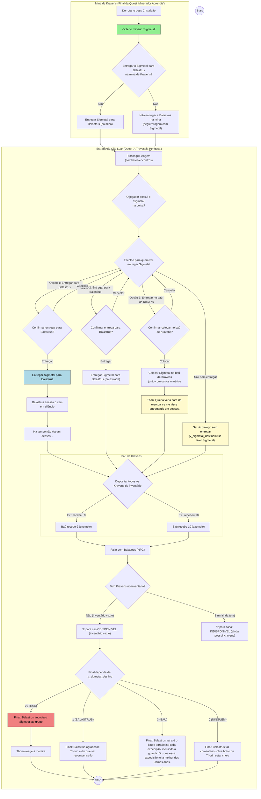

# Fluxo sigmetal

```mermaid
flowchart TD
%% =====================================================
%% Fluxo de Decisão do Item "Sigmetal" (Mermaid atualizado)
%% =====================================================

%% ---- Estilos aproximando as cores do .puml ----
classDef green fill:#90EE90,stroke:#555,color:#000;
classDef coral fill:#F08080,stroke:#555,color:#000;
classDef blue fill:#ADD8E6,stroke:#555,color:#000;
classDef yellow fill:#FFFACD,stroke:#555,color:#000;

%% ---- Nós de início/fim ----
START((Start))
END((Stop))

%% =====================================================
%% Partição: Mina de Kravens (Final da Quest "Minerador Aprendiz")
%% =====================================================
subgraph KRAVENS["Mina de Kravens (Final da Quest 'Minerador Aprendiz')"]
    A1["Derrotar o boss Cristaleão"]
    A2["Obter o minério 'Sigmetal'"]:::green

    %% Nota: O jogador agora possui o item de quest.

    A3{"Entregar o Sigmetal para Balastrus<br>na mina de Kravens?"}

    A4["Entregar Sigmetal para Balastrus (na mina)"]
    %% Efeitos:
    %%  PLAYER_HAS_SIGMETAL=false
    %%  v_sigmetal_destino = 2 (TUSK)

    A5["Não entregar a Balastrus na mina<br>(seguir viagem com Sigmetal)"]
    %% Efeitos:
    %%  PLAYER_HAS_SIGMETAL=true

    A1 --> A2
    A2 --> A3
    A3 -- "Sim" --> A4
    A3 -- "Não" --> A5
end

%% Após a mina, segue a viagem
A4 --> B0
A5 --> B0

%% =====================================================
%% Partição: Estrada do Cão Luar (Quest "A Travessia Perigosa")
%% =====================================================
subgraph ESTRADA["Estrada do Cão Luar (Quest 'A Travessia Perigosa')"]
    B0["Prosseguir viagem (combates/encontros)"]

    %% Check auxiliar: tem Sigmetal na bolsa?
    B1{"O jogador possui o Sigmetal<br>na bolsa?"}

    %% Decisão central (sem opção explícita de "não entregar");
    %% opções 1–3 só aparecem se B1 = Sim
    B2{"Escolhe para quem vai entregar Sigmetal"}

    %% Opções (com confirmar/cancelar nas 1–3)
    %% 1 - Balastrus (apenas se tiver Sigmetal)
    B2a{"Confirmar entrega para Balastrus?"}
    B4["Entregar Sigmetal para Balastrus"]:::blue
  
    %% Efeitos da entrega a Balastrus:
    %%  PLAYER_HAS_SIGMETAL=false
    %%  v_sigmetal_destino = 1 (BALASTRUS)

    %% 2 - Balastrus (apenas se tiver Sigmetal)
    B2b{"Confirmar entrega para Balastrus?"}
    B3["Entregar Sigmetal para Balastrus (na estrada)"]
    
    %% Efeitos:
    %%  PLAYER_HAS_SIGMETAL=false
    %%  v_sigmetal_destino = 2 (TUSK)

    %% 3 - baú de Kravens (apenas se tiver Sigmetal)
    B2c{"Confirmar colocar no baú de Kravens?"}
    B7["Colocar Sigmetal no baú de Kravens<br>junto com outros minérios"]
    
    %% Efeitos:
    %%  PLAYER_HAS_SIGMETAL=false
    %%  v_sigmetal_destino = 3 (BAU)

    %% Observação: não existe opção explícita "Não entregar a ninguém".
    %% Se o jogador sair do diálogo sem confirmar 1–3 e tiver Sigmetal,
    %% então v_sigmetal_destino = 0 (NINGUEM) e o item permanece na bolsa.

    %% Consequências narrativas breves (mantidas do diagrama anterior)
    B5["Balastrus analisa o item<br>em silêncio"]
    B6["Ha tempo não via um desses..."]

    B8["Thori: Queria ver a cara do meu pai se me visse entregando um desses."]:::yellow

    %% Entrega de Kravens no Baú (sempre deposita todos do inventário)
    subgraph BAU["baú de Kravens"]
        D1{"Depositar todos os Kravens do inventário"}
        D2["Baú recebe 9 (exemplo)"]
        D3["Baú recebe 10 (exemplo)"]
        %% Efeitos:
        %%  KRAVENS_INVENTARIO = 0 após depósito (pode voltar depois com mais)
    end

    %% Falar com Balastrus e decidir encerrar cena
    N1["Falar com Balastrus (NPC)"]
    N2{"Tem Kravens no inventário?"}
    N3["'Ir para casa' DISPONÍVEL (inventário vazio)"]
    N4["'Ir para casa' INDISPONÍVEL (ainda possui Kravens)"]

    %% Final baseado em v_sigmetal_destino
    F1{"Final depende de v_sigmetal_destino"}
    C1["Final: Balastrus anuncia o Sigmetal ao grupo"]:::coral
    C2["Thorin reage à mentira"]
    F2["Final: Balastrus agradesse Thorin e diz que vai recompensa-lo"]
    F3["Final: Balastrus vai até o bau e agradesse toda expedição, incluindo a guarda. Diz que essa expedição foi a melhor dos ultimos anos."]
    F4["Final: Balastrus faz comentario sobre bolso de Thorin estar cheio"]

    %% Encadeamentos principais
    B0 --> B1
    B1 --> B2

    %% B2 opções (1–3) — evitar sintaxe de lista no Markdown do Mermaid
    B2 -- "Opção 1: Entregar para Balastrus" --> B2a
    B2 -- "Opção 2: Entregar para Balastrus" --> B2b
    B2 -- "Opção 3: Entregar no baú de Kravens" --> B2c

    %% Confirmação/cancelamento das 1–3 (apenas quando PLAYER_HAS_SIGMETAL = true)
    B2a -- "Entregar" --> B4
    B2a -- "Cancelar" --> B2

    B2b -- "Entregar" --> B3
    B2b -- "Cancelar" --> B2

    B2c -- "Colocar" --> B7
    B2c -- "Cancelar" --> B2

    %% Desdobramentos narrativos curtos após a entrega (seguem viagem)
    B4 --> B5
    B5 --> B6
    B6 --> D1

    B3 --> D1

    B7 --> B8
    B8 --> D1

    %% Saída sem entregar (não é opção explícita):
    %% se PLAYER_HAS_SIGMETAL=true então v_sigmetal_destino=0 e segue
    B2 -- "Sair sem entregar" --> B10
    B10["Sai do diálogo sem entregar<br>(v_sigmetal_destino=0 se tiver Sigmetal)"]:::yellow
    B10 --> D1

    %% Fluxo dos Kravens no Baú
    D1 -- "Ex.: recebeu 9" --> D2
    D1 -- "Ex.: recebeu 10" --> D3
    D2 --> N1
    D3 --> N1

    %% Checagem da opção 'Ir para casa'
    N1 --> N2
    N2 -- "Não (inventário vazio)" --> N3
    N2 -- "Sim (ainda tem)" --> N4

    %% Encerramento quando escolhe 'Ir para casa'
    N3 --> F1

    %% Mapeamento do final por v_sigmetal_destino (inteiros)
    F1 -- "2 (TUSK)" --> C1
    F1 -- "1 (BALASTRUS)" --> F2
    F1 -- "3 (BAU)" --> F3
    F1 -- "0 (NINGUEM)" --> F4

    %% Cena Balastrus na estrada (mantida do diagrama anterior)
    C1 --> C2
    C2 --> END

    %% Finais alternativos também encerram a cena
    F2 --> END
    F3 --> END
    F4 --> END
end
%% =====================================================
%% Legenda (v_sigmetal_destino)
%% 0 = NINGUEM | 1 = BALASTRUS | 2 = TUSK | 3 = BAU
%% Balastrus na mina também seta 2 (TUSK).
%% Opções 1–3 só aparecem se o jogador tiver o Sigmetal na bolsa.
%% Não existe opção "Não entregar a ninguém"; sair sem entregar define 0 se tiver Sigmetal.
%% A opção 'Ir para casa' aparece no Balastrus quando KRAVENS_INVENTARIO = 0.
%% A cena final dispara somente ao escolher 'Ir para casa'.
```
